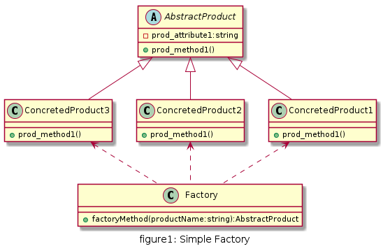

# 简单工厂

## UML

* 工厂(Factory): 根据客户提供的具体产品类的参数，创建具体产品实例
* 抽象产品(Abstract Product): 具体产品类的基类，包含创建产品的公共方法
* 具体产品(Concreted Product): 抽象产品的派生类，包含具体产品特有的实现方法，是简单工厂模式的创建目标



## 优缺点

* 优点
  * 工厂类提供创建具体产品的方法，并包含一定判断逻辑，客户不必参与产品的创建过程
  * 客户只需要知道对应产品的参数即可，参数一般简单好记，如数字、字符或者字符串等
* 缺点
  * 违反开闭原则,再扩展新的产品,需要修改工厂类的逻辑
  * 工厂类权重太大,所有判断逻辑都在工厂类中实现,耦合度太高

## 用例

一个文具用品生产厂,该工厂可以根据客户需求生产铅笔,橡皮和尺子.铅笔,橡皮和尺子被成为产品(Product),产品的名称将作为工厂类方法的参数.
客户根据自身需要向工厂提供产品名称,工厂根据参数生产相应的产品,并交付给客户.

[code](../code/01_SimpleFactory)

```c++
// AbstractProduct.h
#pragma once
class AbstractProduct {
public:
	virtual void action()=0;
};
```

```c++
// Eraser.h
#pragma once
#include "AbstractProduct.h"
class Eraser :
	public AbstractProduct
{
public:
	void action() override;
};

// Eraser.cpp
#include "Eraser.h"
#include <iostream>

void Eraser::action()
{
	std::cout << "You get eraser" << std::endl;
}
```

```c++
// Pencil.h
#pragma once
#include "AbstractProduct.h"
class Pencil :
	public AbstractProduct
{
public:
	void action() override;
};


// Pencil.cpp
#include "Pencil.h"
#include <iostream>

void Pencil::action()
{
	std::cout << "You get pencil" << std::endl;
}
```

```c++
// Ruler.h
#pragma once
#include "AbstractProduct.h"
class Ruler :
	public AbstractProduct
{
public:
	void action() override;

};


// Ruler.cpp
#include "Ruler.h"
#include <iostream>

void Ruler::action()
{
	std::cout << "You get ruler" << std::endl;
}
```

```c++
// Factory.h
#pragma once
#include <string>
#include "AbstractProduct.h"
#include "Ruler.h"
#include "Pencil.h"
#include "Eraser.h"

using namespace std;

class Factory
{
public:
	AbstractProduct* getProduct(string productName);
};

// Factory.cpp
#include "Factory.h"

AbstractProduct* Factory::getProduct(string productName)
{
	AbstractProduct* product = nullptr;

	if (productName == "Ruler")
	{
		product = new Ruler();
	}
	else if (productName == "Pencil")
	{
		product = new Pencil();
	}
	else if (productName == "Eraser")
	{
		product = new Eraser();
	}
	return product;
}
```

```c++
// client.cpp
#include "Factory.h"
// SimpleFactory Client

int main()
{
	Factory* factory = new Factory();

	AbstractProduct* product = nullptr;

	product = factory->getProduct("Ruler");
	product->action();

	product = factory->getProduct("Pencil");
	product->action();

	product = factory->getProduct("Eraser");
	product->action();

	return 0;
}
```

