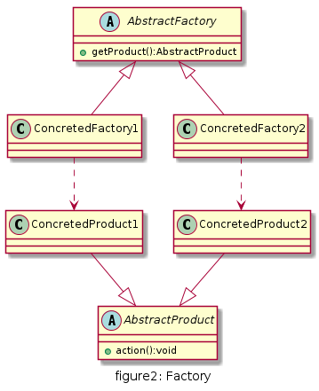
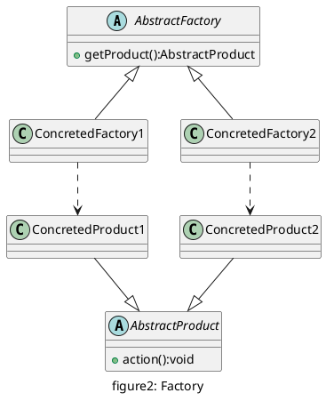

# 工厂方法

## UML

* 抽象工厂(AbstractFactory): 所有生产具体产品的工厂类的基类, 提供工厂类的公共方法；
* 具体工厂(ConcretedFactory): 生产具体的产品
* 抽象产品(AbstractProduct): 所有产品的基类, 提供产品类的公共方法
* 具体产品(ConcretedProduct): 具体的产品类





## 优缺点

* 优点
  * 新加入产品时，无需修改原有代码，增强了系统的可扩展性，符合开闭原则
  * 工厂方法用于创建客户所需产品，同时向客户隐藏某个具体产品类将被实例化的细节，用户只需关心所需产品对应的工厂
* 缺点
  * 系统中类的数量膨胀,每添加一种新产品,同时需要添加对应的工厂类,系统复杂度和开销都增加

## 用例

一个文具用品生产厂,该工厂可以根据客户需求生产铅笔,橡皮和尺子.铅笔,橡皮和尺子被成为产品(Product),产品的名称将作为工厂类方法的参数.
客户根据自身需要向工厂提供产品名称,工厂根据参数生产相应的产品,并交付给客户.(与简单工厂相同)

[code](../code/02_Factory)

```c++
// AbstractFactory.h
#pragma once
#include "AbstractProduct.h"

class AbstractFactory {
public:
	virtual AbstractProduct* getProduct()=0;
};
```

```c++
// RulerFactory.h
#pragma once
#include "AbstractFactory.h"

class RulerFactory:public AbstractFactory
{
public:
	AbstractProduct* getProduct() override;
};

// RulerFactory.cpp
#include "RulerFactory.h"
#include "Ruler.h"

AbstractProduct* RulerFactory::getProduct()
{
	return new Ruler();
}
```

```c++
// PencilFactory.h
#pragma once
#include "AbstractFactory.h"

class PencilFactory:public AbstractFactory
{
public:
	AbstractProduct* getProduct() override;
};

// PencilFactory.cpp
#include "PencilFactory.h"
#include "Pencil.h"

AbstractProduct* PencilFactory::getProduct()
{
	return new Pencil();
}
```

```c++
// EraserFactory.h
#pragma once
#include "AbstractFactory.h"

class EraserFactory:public AbstractFactory
{
public:
	AbstractProduct* getProduct() override;
};

// EraserFactory.cpp
#include "EraserFactory.h"
#include "Eraser.h"

AbstractProduct* EraserFactory::getProduct()
{
	return new Eraser();
}
```

```c++
#include "AbstractFactory.h"
#include "RulerFactory.h"
#include "PencilFactory.h"
#include "EraserFactory.h"
#include "Ruler.h"
#include "Pencil.h"
#include "Eraser.h"

// Factory Client
int main()
{
	AbstractFactory* factory = nullptr;
	AbstractProduct* product = nullptr;

	factory = new RulerFactory();
	product = factory->getProduct();
	product->action();

	factory = new PencilFactory();
	product = factory->getProduct();
	product->action();

	factory = new EraserFactory();
	product = factory->getProduct();
	product->action();

	return 0;
}
```