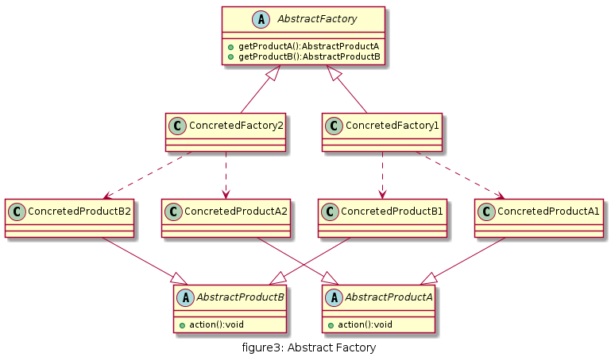
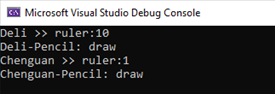

# 抽象工厂

一种为访问类提供一个创建一组相关或相互依赖对象的接口，且访问类无须指定所要产品的具体类就能得到同族的不同等级的产品的模式结构。

## UML

* 抽象工厂(AbstractFactory): 所有生产具体产品的工厂类的基类, 提供工厂类的公共方法；
* 具体工厂(ConcretedFactory): 生产具体的产品
* 抽象产品(AbstractProduct): 所有同类产品的基类, 提供产品类的公共方法
* 具体产品(ConcretedProduct): 具体的产品类

与工厂模式相似,唯一不同的是一个工厂可以生产多种同类的产品



## 优缺点

* 优点
  * 新加入产品系列时，无需修改原有代码，增强了系统的可扩展性，符合开闭原则
  * 工厂方法用于创建客户所需产品，同时向客户隐藏某个具体产品类将被实例化的细节，用户只需关心所需产品对应的工厂
* 缺点
  * 在已经存在的产品系列下新增新的产品,需要修改抽象工厂类,违法开闭原则

## 使用情形

* 系统中使用的产品是成系统和产品族的时候
* 产品系统结构稳定,不会新增或移除某个产品

## 用例

文具用品生产厂可以有不同的品牌厂商,可以根据客户需求生产一个系统品牌下的铅笔,橡皮和尺子.铅笔,橡皮和尺子被成为产品(Product). 假设已知两个文具生产商:得力和晨光.

[code](../code/03_AbstractFactory)

```c++
// AbstractRuler.h
#pragma once

class AbstractRuler {
public:
	virtual int minDistance() = 0;
};

// AbstractPencil.h
#pragma once

class AbstractPencil {
public:
	virtual void draw() = 0;
};
// AbstractFactory.h
#pragma once
#include "AbstractRuler.h"
#include "AbstractPencil.h"

class AbstractFactory {
public:
	virtual AbstractRuler* getRuler() = 0;
	virtual AbstractPencil* getPencil() = 0;
};
```

```c++
// DeliRuler.h
#pragma once
#include "AbstractRuler.h"
class DeliRuler :
	public AbstractRuler {
public:
	int minDistance() override;
};
// DeliPencil.h
#pragma once
#include "AbstractPencil.h"
class DeliPencil :
	public AbstractPencil
{
public:
	void draw() override;
};
```

```c++
// ChenguanRuler.h
#pragma once
#include "AbstractRuler.h"
class ChenguanRuler :
	public AbstractRuler {
public:
	int minDistance() override;
};

// ChenguanPencil.h
#pragma once
#include "AbstractPencil.h"
class ChenguanPencil :
	public AbstractPencil
{
public:
	void draw() override;
};
```

```c++
// DeliFactory.h
#pragma once
#include "AbstractFactory.h"

class DeliFactory :
	public AbstractFactory {
public:
	AbstractRuler* getRuler() override;
	AbstractPencil* getPencil() override;
};

// DeliFactory.cpp
#include "DeliFactory.h"
#include "DeliRuler.h"
#include "DeliPencil.h"

AbstractRuler* DeliFactory::getRuler() {
	return new DeliRuler();
}

AbstractPencil* DeliFactory::getPencil() {
	return new DeliPencil();
}
```

```c++
// ChenguanFactory.h
#pragma once
#include "AbstractFactory.h"
class ChenguanFactory :
	public AbstractFactory
{
public:
	AbstractRuler* getRuler() override;

	AbstractPencil* getPencil() override;
};

// ChenguanFactory.cpp
#include "ChenguanFactory.h"
#include "ChenguanRuler.h"
#include "ChenguanPencil.h"

AbstractRuler* ChenguanFactory::getRuler()
{
	return new ChenguanRuler();
}

AbstractPencil* ChenguanFactory::getPencil()
{
	return new ChenguanPencil();
}
```

```c++
// client.cpp
#include <iostream>
#include "AbstractFactory.h"
#include "AbstractRuler.h"
#include "AbstractPencil.h"
#include "DeliFactory.h"
#include "ChenguanFactory.h"
using namespace std;
// AbstractFactory Client
int main()
{
	AbstractFactory* factory = nullptr;
	AbstractRuler* productRuler = nullptr;
	AbstractPencil* productPencil = nullptr;

	factory = new DeliFactory();
	productRuler = factory->getRuler();
	productPencil = factory->getPencil();
	cout << "Deli >> ruler:" << productRuler->minDistance() << endl;
	productPencil->draw();

	factory = new ChenguanFactory();
	productRuler = factory->getRuler();
	productPencil = factory->getPencil();
	cout << "Chenguan >> ruler:" << productRuler->minDistance() << endl;
	productPencil->draw();
	return 0;
}
```

