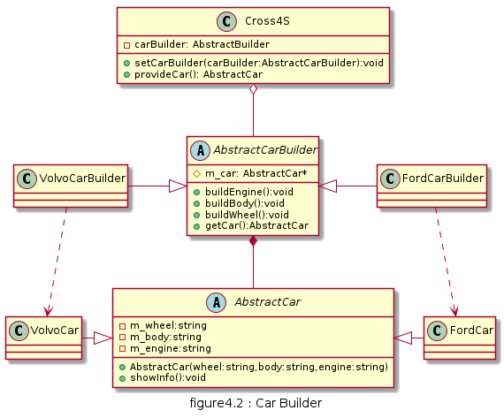

# 建造者

将一个复杂对象的构造与它的表示分离，使同样的构建过程可以创建不同的表示，这样的设计模式被称为建造者模式。

## UML

* 抽象建造者(AbstractBuilder): 创建一个Product对象的各个部件指定的抽象接口
* 具体建造者(ConcretedBuilder): 实现AbstractBuilder的接口, 实现各个部件的具体构造方法和装配方法, 并返回创建结果
* 产品(Product): 具体的产品对象
* 指挥者(Director): 构建一个使用Builder接口的对象, 安排复杂对象的构建过程, 隔离客户与对象的生产过程，并负责控制产品对象的生产过程


## 优缺点

* 优点
  * 建造者模式中，客户端不需要知道产品内部组成细节,分离了产品与产品创建 

* 缺点
  * 创建的产品一般具有较多的共同点，其组成部分相似, 若差异过大,则不适用
  * 若产品内部变化过于复杂,则需要定义多样的建造者类来覆盖这些变化,加大系统复杂度

## 用例
一个同品牌汽车4S店可以为客户提供福特和沃尔沃的汽车, 4S接到客户的需求车型, 向对应的汽车生产厂商订购,最终再提供给客户



此处实现有些小变形, 由于C++中没有package访问修饰符, 故只暴露汽车类的showInfo()方法

原先的setPart方法改由汽车的带参构造函数完成,这样在Builder类中也做稍许改造,除了持有Car类的引用,还直接定义了Car类的部件属性.

[code](../code/04_Builder)

```c++
// AbstractCar.h
#pragma once
#include <string>
#include <iostream>
using namespace std;

class AbstractCar {
public:
	AbstractCar() {}
	AbstractCar(string wheel, string body, string engine) :m_wheel(wheel), m_body(body), m_engine(engine) {}
	virtual void showInfo() {
		cout << "Wheel-" << m_wheel << ",Body-" << m_body << ",Engine-" << m_engine << endl;
	}
protected:
	void setWheel(string wheel) {
		this->m_wheel = wheel;
	}
	void setBody(string body) {
		this->m_body = body;
	}
	void setEngine(string engine) {
		this->m_engine = engine;
	}
private:
	string m_wheel;
	string m_body;
	string m_engine;
};

// FordCar.h
#pragma once
#include "AbstractCar.h"
class FordCar :
	public AbstractCar
{
public:
	FordCar(string wheel, string body, string engine):AbstractCar(wheel,body,engine) {}
	void showInfo() override {
		cout << "Ford\n";
		AbstractCar::showInfo();
	}
};
```

```c++
// AbstractCarBuilder.h
#pragma once
#include "AbstractCar.h"

class AbstractCarBuilder {
public:
	virtual void buildEngine() = 0;
	virtual void buildBody() = 0;
	virtual void buildWheel() = 0;
	virtual AbstractCar* getCar() = 0;
protected:
	AbstractCar* m_car = nullptr;
	string m_engine, m_wheel, m_body;
};

// FordCarBuilder.h
#pragma once
#include "AbstractCarBuilder.h"
#include "FordCar.h"

class FordCarBuilder :
	public AbstractCarBuilder
{
public:
	void buildEngine() {
		m_engine = "ENG-F_001";
	}
	void buildBody() {
		m_body = ("BOY-F_001");
	}
	void buildWheel() {
		m_wheel = ("WHL-F_001");
	}
	AbstractCar* getCar() {
		if(this->m_car==nullptr)
			this->m_car = new FordCar(m_wheel,m_body,m_engine);
		return this->m_car;
	}
};
```

```c++
// Cross4S.h
#pragma once
#include "AbstractCar.h"
#include "AbstractCarBuilder.h"

class Cross4S
{
public:
	void setCarBuilder(AbstractCarBuilder* carBuilder) {
		this->m_carBuilder = carBuilder;
	}
	AbstractCar* provideCar() {
		m_carBuilder->buildEngine();
		m_carBuilder->buildBody();
		m_carBuilder->buildWheel();
		return m_carBuilder->getCar();
	}
private:
	AbstractCarBuilder* m_carBuilder;
};
```

```c++
// client.cpp
#include "Cross4S.h"
#include "FordCarBuilder.h"
#include "VolvoCarBulder.h"

int main() {
	AbstractCar* car = nullptr;
	Cross4S shop;
	shop.setCarBuilder(new FordCarBuilder);
	car = shop.provideCar();
	car->showInfo();

	shop.setCarBuilder(new VolvoCarBuilder);
	car = shop.provideCar();
	car->showInfo();
}
```


[Java code](../code/Javacode/src/main/java/com/openthinks/samples/pattern4j/builder)