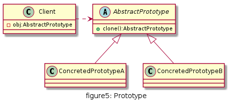
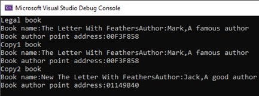

# 原型

使用原型实例指定待创建对象的类型，并且通过复制这个原型阿里创建型的对象。

## UML
    
* 抽象原型类(AbstractPrototype)：声明克隆clone自身的接口
* 具体原型类(ConcretedPrototype)：实现clone接口
* 客户端(Client)：客户端中声明一个抽象原型类，根据客户需求clone具体原型类对象实例



## 优缺点

* 优点
  * 当创建新的对象实例较为复杂时，原型模式可以简化创建过程，提高创建对象的效率
  * 可扩展：模式中提供了抽象原型类，具体原型类可适当扩展
  * 创建结构简单：创建工厂即为原型对象本身

* 缺点
  * 深克隆代码较为复杂
  * 每一个类都得配备一个clone方法，且该方法位于类的内部，修改时违背开闭原则

## 使用场景

* 对象之间相同或相似，即只是个别的几个属性不同的时候。
* 对象的创建过程比较麻烦，但复制比较简单的时候。


## 用例
盗版书商要盗版一本爆款书A,书的信息有书名及作者信息, 盗版商出于省事和快速, 就直接原封不动的拷贝了原书A, 书名和作者信息一模一样, 后来盗版商发现有被告的风险,于是修改了一些信息


[code](../code/05_Prototype)

```c++
// Book.h
#pragma once

#include <string>
#include <iostream>
using namespace std;
struct Author {
	string name;
	string desc;
	Author(string n, string d) {
		this->desc = d;
		this->name = n;
	}
};
class Book {
public:
	Book(const string name, Author* author)
	{
		this->m_author = author;
		this->m_name = name;
	}
	virtual Book* clone() = 0;
	virtual Book* deepClone() = 0;
	inline void printInfo()
	{
		cout << "Book name:" << m_name << "Author:" << m_author->name << "," << m_author->desc << endl;
		cout << "Book author point address:" << m_author << endl;
	}

protected:
	string m_name;
	Author* m_author;
};
```

```c++
// CrazyBook.h
#pragma once
#include "Book.h"
class CrazyBook :
	public Book
{
public:
	CrazyBook(const string name, Author* author);
	CrazyBook(string bookName, string authorName, string authorDesc);
	Book* clone() override;
	Book* deepClone() override;
};
// CrazyBook.cpp
#include "CrazyBook.h"
CrazyBook::CrazyBook(const string name, Author* author) :Book(name, author) {}
CrazyBook::CrazyBook(string bookName, string authorName, string authorDesc) : Book(bookName, new Author(authorName, authorDesc))
{
}
// simple copy
Book* CrazyBook::clone()
{
	Book* copy = new CrazyBook(this->m_name, this->m_author);
	return copy;
}
// deep copy
Book* CrazyBook::deepClone()
{
	string newBookName = "New " + this->m_name;
	Author* newAuthor = new Author("Jack", "A good author");
	Book* copy = new CrazyBook(newBookName, newAuthor);
	return copy;
}
```

```c++
// client.cpp
#include <iostream>
#include "CrazyBook.h"

using namespace std;

int main() {
	Author legalAuthor("Mark", "A famous author");
	Book* legalBook = new CrazyBook("The Letter With Feathers", &legalAuthor);
	cout << "Legal book" << endl;
	legalBook->printInfo();

	Book* copyBook1 = legalBook->clone();
	cout << "Copy1 book" << endl;
	copyBook1->printInfo();
	

	Book* copyBook2 = legalBook->deepClone();
	cout << "Copy2 book" << endl;
	copyBook2->printInfo();

	return 0;
}
```

