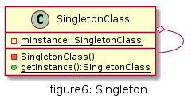
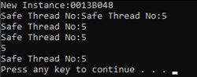

# 单例

## UML



## 优缺点

* 优点
  * 单例模式提供了严格的对唯一实例的创建和访问
  * 单例模式的实现可以节省系统资源


* 缺点
  * 多线程下需要考虑线程安全机制
  * 单例模式没有抽象层,不能进行扩展
  * 单例类的职责过多但又需要单例,则违法单一职责


## 用例
数据库驱动实例一个系统中,只需要一个实例,然后通过这个实例创建数据连接.

[code](../code/06_Singleton)

### 非线程安全

```c++
// DatabaseDriver.h
#pragma once
class DatabaseDriver
{
public:
	static DatabaseDriver* getInstance();
	static void release();
private:
	DatabaseDriver();
	~DatabaseDriver();
	static DatabaseDriver* m_instance;
};

// DatabaseDriver.cpp
#include "DatabaseDriver.h"
DatabaseDriver* DatabaseDriver::m_instance = nullptr;

DatabaseDriver::DatabaseDriver() {

}

DatabaseDriver::~DatabaseDriver() {

}

DatabaseDriver* DatabaseDriver::getInstance() {
	if (m_instance == nullptr) {
		m_instance = new DatabaseDriver();
	}
	return m_instance;
}

void DatabaseDriver::release() {
	if (m_instance != nullptr) {
		delete m_instance;
		m_instance = nullptr;
	}
}

```

```c++
// client.cpp
#include "DatabaseDriver.h"
#include <iostream>
using namespace std;

int main() {
	DatabaseDriver* driverA = DatabaseDriver::getInstance();

	DatabaseDriver* driverB = DatabaseDriver::getInstance();

	cout << "DriverA pointed address:" << (driverA) << ", DriverB pointed address:" << (driverB)<<"; equals:"<<(driverA==driverB) << endl;
}
```

### 线程安全

```c++
// ThreadSafeDatabaseDriver.h
#pragma once
#include <mutex>
using namespace std;
class ThreadSafeDatabaseDriver
{
public:
	static ThreadSafeDatabaseDriver* getInstance();
	static void release();
private:
	ThreadSafeDatabaseDriver();
	~ThreadSafeDatabaseDriver();
	static ThreadSafeDatabaseDriver* m_instance;
	static mutex m_mutex;
};

// ThreadSafeDatabaseDriver.cpp
#include "ThreadSafeDatabaseDriver.h"

#include <iostream>
using namespace std;

ThreadSafeDatabaseDriver* ThreadSafeDatabaseDriver::m_instance = nullptr;
mutex ThreadSafeDatabaseDriver::m_mutex;

ThreadSafeDatabaseDriver::ThreadSafeDatabaseDriver() {
	cout << "New Instance:" << this << endl;
}

ThreadSafeDatabaseDriver::~ThreadSafeDatabaseDriver() {

}

ThreadSafeDatabaseDriver* ThreadSafeDatabaseDriver::getInstance() {
	if (m_instance == nullptr) {
		m_mutex.lock();
		if (m_instance == nullptr) {
			m_instance = new ThreadSafeDatabaseDriver();
		}
		m_mutex.unlock();
	}
	return m_instance;
}

void ThreadSafeDatabaseDriver::release() {
	if (m_instance != nullptr) {
		delete m_instance;
		m_instance = nullptr;
	}
}
```

```c++
#include "DatabaseDriver.h"
#include "ThreadSafeDatabaseDriver.h"
#include <iostream>
#include <Windows.h>
#include <process.h>

using namespace std;
#define THREAD_NUM 5

unsigned int __stdcall call_singletone(void* pPm) {
	DatabaseDriver* driver = DatabaseDriver::getInstance();
	int nThreadNum = *(int*)pPm;
	Sleep(50);
	cout << "Thread No:" << nThreadNum << endl;
	return 0;
}

unsigned int __stdcall call_safeSingletone(void* pPm) {
	ThreadSafeDatabaseDriver* driver = ThreadSafeDatabaseDriver::getInstance();
	int nThreadNum = *(int*)pPm;
	Sleep(50);
	cout << "Safe Thread No:" << nThreadNum << endl;
	return 0;
}

void simpleTest() {
	DatabaseDriver* driverA = DatabaseDriver::getInstance();

	DatabaseDriver* driverB = DatabaseDriver::getInstance();

	cout << "DriverA pointed address:" << (driverA) << ", DriverB pointed address:" << (driverB) << "; equals:" << (driverA == driverB) << endl;
}

int multithreadTest(bool threadSafe=false) {
	HANDLE  handle[THREAD_NUM];
	int threadNum = 0;
	while (threadNum < THREAD_NUM)
	{
		if (threadSafe) {
			handle[threadNum] = (HANDLE)_beginthreadex(NULL, 0, call_safeSingletone, &threadNum, 0, NULL);
		}
		else {
			handle[threadNum] = (HANDLE)_beginthreadex(NULL, 0, call_singletone, &threadNum, 0, NULL);
		}
		threadNum++;
	}
	WaitForMultipleObjects(THREAD_NUM, handle, TRUE, INFINITE);
	system("pause");
	return 0;

}

int main() {
	//simpleTest();
	//multithreadTest();
	multithreadTest(true);
	return 0;
}
```

