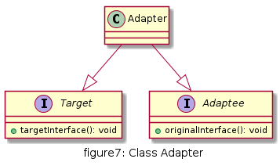
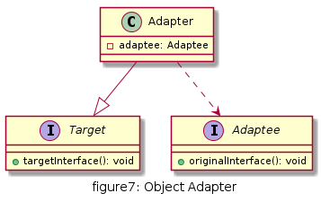

# 适配器

将一个类的接口转换成客户希望的另一个接口。适配器模式让那些接口不兼容的类可以一起工作。

## UML

* 适配器类(Adapter)：适配器与目标抽象类之间是继承,实现关系；
* 适配者类(Adaptee)：适配器与适配者之间是继承或关联关系。
* 目标抽象类(Target)：定义客户所需要的接口。




## 优缺点

* 优点
  * 将目标类和适配者类解耦，引入一个适配器类实现代码重用，无需修改原有结构；
  * 增加类的透明和复用，对于客户端而言，适配者类是透明的；
  * 对象适配器可以把不同适配者适配到同一个目标（对象适配器）；


* 缺点
  * 对编程语言的限制：Java不支持多重继承，一次最多只能适配一个适配者类，不能同时适配多个适配者类

## 使用场景

* 系统需要使用一些现有的类，但这些类的接口不符合系统需要，或者没有这些类的源代码
* 想创建一个重复使用的类，用于和一些彼此没有太大关联的类一起工作

## 用例
最新的小米手机充电接口是type-c,音频输出接口也是type-c接口，和充电共用一个type-c接口，现有3.5mm耳机使用不了，只能使用type-c转3.5mm插孔的适配器

[code](../code/07_Adapter)

```c++
// HeadsetJack.h
#pragma once
class TraditionJack {
public:
	virtual void output35mm() = 0;
};

class TypecJack {
public:
	virtual void outputtypec() = 0;
};
```

```c++
// TypecJackAdapter.h
#pragma once
#include "HeadsetJack.h"
class TypecJackAdapter :
	public TypecJack, public TraditionJack
{
public:
	void output35mm() override;
	void outputtypec() override;
};

// TypecJackAdapter.cpp
#include "TypecJackAdapter.h"
#include <iostream>
using namespace std;

void TypecJackAdapter::output35mm()
{
	outputtypec();
}

void TypecJackAdapter::outputtypec()
{
	cout << "Music is on going now..." << endl;
}
```

```c++
// client.cpp
#include "HeadsetJack.h"
#include "TypecJackAdapter.h"

class Mi8Phone {
public:
	void setJack(TypecJack* jack) {
		this->m_jack = jack;
	}
	void playSound() {
		if (m_jack) {
			m_jack->outputtypec();
		}
	}
private:
	TypecJack* m_jack = nullptr;
};

class OldHeadSet {
public:
	void setJack(TraditionJack* jack) {
		this->m_jack = jack;
	}
	void listenSound() {
		if (m_jack) {
			m_jack->output35mm();
		}
	}
private:
	TraditionJack* m_jack = nullptr;
};

int main() {
	TypecJackAdapter* adapterJack = new TypecJackAdapter();

	Mi8Phone phone;
	OldHeadSet headset;

	phone.setJack(adapterJack);
	headset.setJack(adapterJack);
	phone.playSound();
	headset.listenSound();
	return 0;
}
```