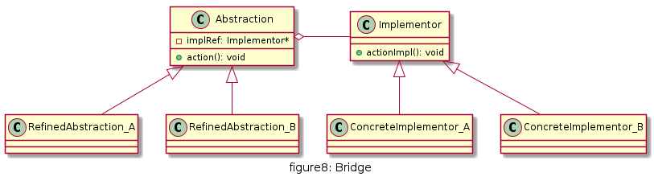
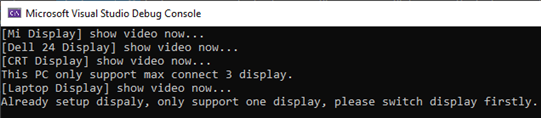

# 桥接

将抽象部分与它的实现部分解耦，使得两者都能够独立变化。

## UML

* Abstraction（抽象类）：定义抽象类的接口（抽象接口），抽象类中包含一个Implementor类型的对象
* Implementor（实现类接口）：定义实现类的接口，这个接口可以与Abstraction类的接口不同。实现类接口只定义基本操作，而抽象类的接口还可能会做更多复杂的操作
* RefinedAbstraction（扩充抽象类）：具体类，实现在抽象类中定义的接口，可以调用在Implementor中定义的方法
* ConcreteImplementor（具体实现类）：具体实现了Implementor接口，在不同的具体实现类中实现不同的具体操作。运行时ConcreteImplementor将替换父类



## 优缺点

* 优点
 * 分离抽象接口与实现部分，使用对象间的关联关系使抽象与实现解耦
 * 桥接模式可以取代多层继承关系，多层继承违背单一职责原则，不利于代码复用
 * 桥接模式提高了系统可扩展性，某个维度需要扩展只需增加实现类接口或者具体实现类，而且不影响另一个维度，符合开闭原则


* 缺点
 * 桥接模式难以理解，因为关联关系建立在抽象层，需要一开始就设计抽象层
 * 如何准确识别系统中的两个维度是应用桥接模式的难点。


## 使用场景

如果系统中的某个类存在两个独立变化的维度，通过桥接模式可以将这两个维度分离开来，使两者独立扩展。

## 用例

我们知道通过电脑可以观看下载的电影, 那么电脑一般包含主机和显示器,主机提供输出信号, 显示器进行显示, 电脑可以是台是机也可以是笔记本, 显示器可以是不同尺寸的液晶显示,也可以是老旧的CRT显示器. 现假设 笔记本不支持外接显示器,只支持原厂只带的屏幕, 台式机可以接最多3个显示器

[code](../code/08_Bridge)

```c++
// Computer.h
#pragma once

class Display;
class Computer {
public:
	virtual void playVideo() = 0;
	virtual void addDisplay(Display* display) = 0;
};

// Display.h
#pragma once
class Display {
public:
	virtual void show() = 0;
};
```

```c++
// PC.h
#pragma once
#include "Computer.h"
#include <list>
using namespace std;

constexpr auto MAX_DISPLAY_COUNT = 3;

class PC :
	public Computer
{
public:
	void playVideo() override;
	void addDisplay(Display* display) override;
	inline int displaySize() {
		return m_displays.size();
	}
private:
	list<Display*> m_displays;
};

// PC.cpp
#include "PC.h"
#include "Display.h"
#include <iostream>

void PC::playVideo()
{	
	list<Display*>::iterator iter =  m_displays.begin();
	while (iter!=m_displays.end()) {
		(*iter)->show();
		iter++;
	}

}

void PC::addDisplay(Display* display)
{
	if (displaySize() >= MAX_DISPLAY_COUNT) {
		cout << "This PC only support max connect 3 display." << endl;
		return;
	}
	m_displays.push_back(display);
}
```

```c++
// Laptop.h
#pragma once
#include "Computer.h"

class Display;
class Laptop :
	public Computer
{
public:
	void playVideo() override;
	void addDisplay(Display* display) override;
	void switchDisplay(Display* newDisplay);
private:
	Display* m_display;
};

// Laptop.cpp
#include "Laptop.h"
#include "Display.h"
#include <iostream>
using namespace std;

void Laptop::playVideo()
{
	if (m_display) {
		m_display->show();
	}
}

void Laptop::addDisplay(Display* display)
{
	if (m_display == nullptr) {
		m_display = display;
	}
	else {
		cout << "Already setup dispaly, only support one display, please switch display firstly." << endl;
	}
}

void Laptop::switchDisplay(Display* newDisplay)
{
	m_display = newDisplay;
	cout << "Switch a new display." << endl;
}
```

```c++
// MyDisplays.h
#pragma once
#include "Display.h"
#include <iostream>
using namespace std;

class MiDisplay :
	public Display
{
public:
	void show() {
		cout << "[Mi Display]"<<" show video now..." << endl;
	}
};

class Dell24Display :
	public Display
{
public:
	void show() {
		cout << "[Dell 24 Display]" << " show video now..." << endl;
	}
};

class CRTDisplay :
	public Display
{
public:
	void show() {
		cout << "[CRT Display]" << " show video now..." << endl;
	}
};


class LaptopDisplay :public Display {
public:
	void show() {
		cout << "[Laptop Display]" << " show video now..." << endl;
	}
};
```

```c++
// client.cpp
#include "Computer.h"
#include "Display.h"
#include "PC.h"
#include "Laptop.h"
#include "MyDisplays.h"

int main() {

	Computer* myComputer = new PC();
	myComputer->addDisplay(new MiDisplay());
	myComputer->addDisplay(new Dell24Display());
	myComputer->addDisplay(new CRTDisplay());
	myComputer->playVideo();

	Display* addtionDisplay = new MiDisplay();
	myComputer->addDisplay(addtionDisplay);

	myComputer = new Laptop();
	myComputer->addDisplay(new LaptopDisplay());
	myComputer->playVideo();

	myComputer->addDisplay(addtionDisplay);
	return 0;
}
```

