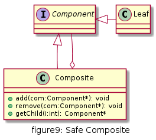
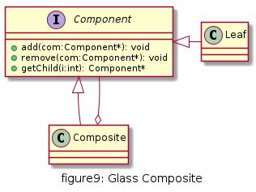
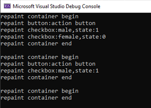

# 组合

组合多个对象形成树形结构以表示具有部分-整体关系的层次结构。组合模式让客户端可以统一对待单个对象和组合对象。

## UML

* Component(抽象构件): Component是一个抽象类，定义了构件的一些公共接口,具体的实现在叶子构件和容器构件中进行
* Leaf(叶子构件): 它代表树形结构中的叶子节点对象，叶子构件没有子节点，它实现了在抽象构件中定义的行为。
* Composite(容器构件): 容器构件通过聚合关系包含子构件，子构件可以是容器构件，也可以是叶子构件

### 安全组合



严格区分叶子节点和容器节点, 抽象节点只具有最少的公共接口, 容器节点包含大量的容器操作接口; 对于叶子节点则不需要添加容器节点的接口,符合接口隔离原则. 不过客户端使用需要区别对待叶子节点和容器节点


### 透明组合



顾名思义, 客户端使用时不需要区分对待容器节点和叶子节点,他们有基本一样的接口, 公共接口都定义在抽象节点. 叶子节点时,一些适用于容器节点的接口需要空实现或抛异常等处理

## 优缺点

* 优点
  * 清楚地定义分层次的复杂对象，表示出复杂对象的层次结构，让客户端忽略层次的差异
  * 客户端可以一致地使用层次结构中各个层次的对象，而不必关心其具体构件的行为如何实现
  * 在组合模式中增加新的叶子构件和容器构件非常方便，易于扩展，符合开闭原则
  * 为树形结构的案例提供了解决方案

* 缺点
  * 子构件或容器构件的行为受限制，因为它们来自相同的抽象层。如果要定义某个容器或者某个叶子节点特有的方法，那么要求在运行时判断对象类型，增加了代码的复杂度。

## 使用场景

* 系统中需要用到树形结构
* 系统中能够分离出容器节点和叶子节点
* 具有整体和部门的层次结构中，能够通过某种方式忽略层次差异，使得客户端可以一致对待

## 用例

Java中的AWT,Swing GUI编程,Qt WidgetGUI编程或者MFC图形化编程基本上都有一个组件树,有具体的控件,有容器控件,都是组合模式的经典使用.

[code](../code/09_composite)

```c++
// awt.h

#pragma once
#include <iostream>
#include <string>
#include <list>
using namespace std;

class Component {
public:
	inline bool isVisible() {
		return m_visible;
	}
	inline void setVisible(bool b) {
		this->m_visible = b;
	}
	virtual void repaint() = 0;
protected:
	bool m_visible = true;
};

class Container :public Component {
public:
	void add(Component* comp);
	void remove(Component* comp);
	void removeAll();
	void repaint() override;
private:
	list<Component*> m_components;
};

class Button :public Component {
public:
	explicit Button();
	explicit Button(string label);
	inline string getLabel() {
		return m_label;
	}
	inline void setLabel(string label) {
		this->m_label = label;
	}
	void repaint() override;
private:
	string m_label;
};

class Checkbox :public Component {
public:
	explicit Checkbox();
	explicit Checkbox(string label,bool state);
	inline string getLabel() {
		return m_label;
	}
	inline void setLabel(string label) {
		this->m_label = label;
	}
	inline bool getState() {
		return m_state;
	}
	inline void setState(bool state) {
		this->m_state = state;
	}
	void repaint() override;
private:
	string m_label;
	bool m_state = false;
};
```

```c++
// awt.cpp

#include "awt.h"

void Container::add(Component* comp)
{
	m_components.push_back(comp);
}

void Container::remove(Component* comp)
{
	m_components.remove(comp);
}

void Container::removeAll()
{
	m_components.clear();
}

void Container::repaint()
{
	cout << "repaint container begin" << endl;

	list<Component*>::const_iterator iter = m_components.cbegin();
	while (iter != m_components.cend()) {
		(*iter)->repaint();
		iter++;
	}

	cout << "repaint container end\n" << endl;
}

Button::Button()
{
}

Button::Button(string label):m_label(label)
{
}

void Button::repaint()
{
	if (m_visible) {
		cout << "repaint button:" << getLabel() << endl;
	}
}

Checkbox::Checkbox()
{
}

Checkbox::Checkbox(string label, bool state):m_label(label),m_state(state)
{
}

void Checkbox::repaint()
{
	if (m_visible) {
		cout << "repaint checkbox:" << getLabel() << ",state:" << getState() << endl;
	}
}
```

```c++
// client.cpp

#include "awt.h"

int main() {
	Container panel;
	Component* comp1 = new Button("action button");
	panel.add(comp1);
	Component* comp2 = new Checkbox("male",true);
	panel.add(comp2);
	comp2 = new Checkbox("female", false);
	panel.add(comp2);
	panel.repaint();

	panel.remove(comp2);
	panel.repaint();

	panel.removeAll();
	panel.repaint();
	return 0;
}
```

