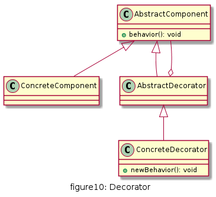
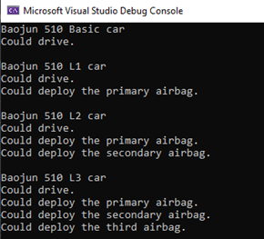

# 装饰

动态地给一个对象增加一些额外的职责。就扩展功能而言，装饰模式提供了一种比使用子类更加灵活的替代方案.

## UML

* AbstractComponent(抽象构件) : 是具体构件类和装饰类的共同基类,声明了在具体构件中定义的方法
* ConcreteComponent(具体构件) : 具体构件定义了构件具体的方法，装饰类可以给它增加更多的功能
* AbstractDecorator(抽象装饰类) : 用于给具体构件增加职责，但具体职责在其子类中实现. 通过聚合的方式定义一个抽象构建的引用.
* ConcreteDecorator(具体装饰类) : 向构件增加新的功能,即新的方法



## 优缺点

* 优点
  * 对于扩展一个类的新功能，装饰模式比继承更加灵活
  * 可以对一个对象进行多次装饰
  * 具体构件类和具体装饰类可以独立变化和扩展，符合开闭原则

* 缺点
  * 装饰模式中会增加很多小的对象,占用较多的系统资源
  * 装饰模式比继承模式更灵活，更容易出错，更难于排错


## 使用场景

* 在不影响其他对象的情况下，需要给单个对象动态扩展职责
* 不适宜采用继承的方式进行扩展的时候，可以考虑使用装饰模式
* 侧重点在于包装扩展构建的功能,客户需要能同时访问装饰类和构建类


## 用例
汽车OEM在上市一款新车型时往往会提供不同的配置来满足不同层次的需求. 譬如上汽的宝骏510 17款 有手动舒适版,时尚版(+副驾安全气囊),豪华版(+副侧安全气囊)


[code](../code/10_decorator)

```c++
// cartypes.h
#pragma once
#include <string>
#include <iostream>
using namespace std;

class Car {
public:
	virtual void drive() = 0;
};

class BaoJunCar510 :public Car {
public:
	void drive() override;
};

class CarWarpper :public Car {
public:
	explicit CarWarpper(Car* car);
	virtual void drive() = 0;
protected:
	Car* m_car;
};

class Car4MainAirbg :public CarWarpper {
public:
	explicit Car4MainAirbg(Car* car);
	void drive() override;
	void deployPrimaryAirBag();
};

class Car4SencondAirbg :public CarWarpper {
public:
	explicit Car4SencondAirbg(Car* car);
	void drive() override;
	void deploySecondAirBag();
};

class Car4ThirdAirbg :public CarWarpper {
public:
	explicit Car4ThirdAirbg(Car* car);
	void drive() override;
	void deployThirdAirBag();
};
```

```c++
//cartypes.cpp
#include "cartypes.h"

void BaoJunCar510::drive()
{
	cout <<"Could drive." << endl;
}

CarWarpper::CarWarpper(Car* car):m_car(car)
{
}

Car4MainAirbg::Car4MainAirbg(Car* car):CarWarpper(car)
{
}

void Car4MainAirbg::drive()
{
	this->m_car->drive();
	this->deployPrimaryAirBag();
}

void Car4MainAirbg::deployPrimaryAirBag()
{
	cout << "Could deploy the primary airbag." << endl;
}

Car4SencondAirbg::Car4SencondAirbg(Car* car):CarWarpper(car)
{
}

void Car4SencondAirbg::drive()
{
	this->m_car->drive();
	this->deploySecondAirBag();
}

void Car4SencondAirbg::deploySecondAirBag()
{
	cout << "Could deploy the secondary airbag." << endl;
}

Car4ThirdAirbg::Car4ThirdAirbg(Car* car):CarWarpper(car)
{
}

void Car4ThirdAirbg::drive()
{
	this->m_car->drive();
	this->deployThirdAirBag();
}

void Car4ThirdAirbg::deployThirdAirBag()
{
	cout << "Could deploy the third airbag." << endl;
}
```

```c++
// client.cpp
#include "cartypes.h"

int main() {
	cout <<"Baojun 510 Basic car"<< endl;

	Car* baseCar = new BaoJunCar510();
	baseCar->drive();
	
	cout << "\nBaojun 510 L1 car" << endl;
	Car* type1 = new Car4MainAirbg(baseCar);
	type1->drive();
	cout << endl;

	cout << "Baojun 510 L2 car" << endl;
	Car* type2 = new Car4SencondAirbg(type1);
	type2->drive();
	cout << endl;

	cout << "Baojun 510 L3 car" << endl;
	Car* type3 = new Car4ThirdAirbg(type2);
	type3->drive();

	return 0;
}
```

