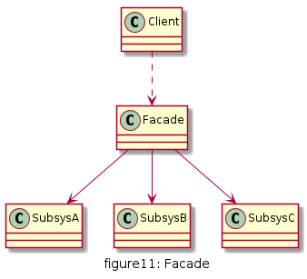

# 外观

为子系统中的一组接口提供一个统一的入口。外观模式定义了一个高层接口，这个接口使得这一子系统更加容易使用。

## UML

* Facade(外观角色) : 外观角色知道多个子系统的功能与接口, 它能够接收客户端发来的所有请求,并将其委派到相应的子系统,进行处理.
* SubSystem(子系统角色) : 子系统是一个类,或多个类组成的集合, 实现子系统的具体功能




## 优缺点

* 优点
  * 外观模式使得客户端不必关心子系统组件，减少了与客户端交互的对象的数量，简化了客户端的编程
  * 外观模式可以大大降低系统的耦合度
  * 子系统的变化并不需要修改客户端，只需要适当修改外观类即可
  * 子系统之间不会相互影响

* 缺点
  * 如果需要增加或者减少子系统，需要修改外观类，违反开闭原则
  * 并不能限制客户端直接与子系统交互，但如果加强限制，又使得系统灵活度降低


## 使用场景

* 为访问一系列复杂的子系统提供一个统一的、简单的入口，可以使用外观模式
* 客户端与多个子系统之间存在很大依赖，但在客户端编程，又会增加系统耦合度，且使客户端编程复杂，可以使用外观模式


## 用例

餐厅吃饭,通过服务员点单,我们只需要在餐桌就坐就行, 服务员负责把我们点的单发送到后厨,后厨做好后由传菜员上菜,服务员再给我们端到餐桌上就餐,最后通知服务员买单,整个过程,我们只需要和服务员沟通,且服务员帮我们完成所有需要的服务.


[code](../code/11_facade)

```c++
// dining.h
#pragma once
#include <iostream>
#include <string>
using namespace std;

class Cook {
public:
	inline void cook() {
		cout << "Cook is cooking" << endl;
	}
};

class BusBoy {
public:
	inline void delivery() {
		cout << "Busboy is delivering" << endl;
	}
};

class Cashier {
public:
	inline void checkout() {
		cout << "Cashier is checkouting" << endl;
	}
};

class Waitress {
public:
	explicit Waitress() {
		m_cook = new Cook();
		m_boy = new BusBoy();
		m_cashier = new Cashier();
	}
	void order() {
		m_cook->cook();
		m_boy->delivery();
	}
	void pay() {
		m_cashier->checkout();
	}
private:
	Cook* m_cook;
	BusBoy* m_boy;
	Cashier* m_cashier;
};
```

```c++
// client.cpp
#include "dining.h"

int main() {

	Waitress* waitress = new Waitress();
	waitress->order();
	waitress->pay();

	return 0;
}
```