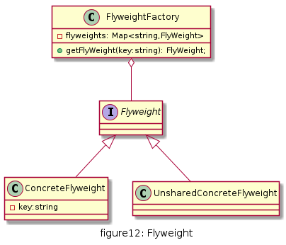

# 享元

运用共享技术来有效地支持大量细粒度对象的复用。它通过共享已经存在的对象来大幅度减少需要创建的对象数量、避免大量相似类的开销，从而提高系统资源的利用率。

## UML

享元模式常常结合工厂模式一起使用，其结构包含抽象享元类、具体享元类、非共享具体享元类和享元工厂类：
* Flyweight(抽象享元类): 是一个抽象类，声明了具体享元类公共的方法，这些方法可以向外部提供享元对象的内部状态数据，也可以通过这些方法设置外部状态
* ConcreteFlyweight(具体享元类): 具体实现抽象享元类声明的方法，具体享元类中为内部状态提供存储空间
* UnsharedConcreteFlyweight(非共享具体享元类): 并不是所有抽象享元类的子类都需要被共享，可以将这些类设计为非共享具体享元类
* FlyweightFactory(享元工厂类): 于创建并管理享元对象，针对抽象享元类编程，将各种具体享元类对象存储在一个享元池中，享元池一般设计为一个存储键值对的集合（或者其他类型的集合），可结合工厂模式设计。客户需要某个享元对象时，如果享元池中已有该对象实例，则返回该实例，否则创建一个新的实例，给客户返回新的实例，并将新实例保存在享元池中



## 优缺点

* 优点
  * 享元模式通过享元池存储已经创建好的享元对象，实现相同或相似的细粒度对象的复用，大大减少了系统中的对象数量，节约了内存空间，提升了系统性能
  * 享元模式通过内部状态和外部状态的区分，外部状态相互独立，客户端可以根据需求任意使用

* 缺点
  * 享元模式需要增加逻辑来取分出内部状态和外部状态，增加了编程的复杂度

## 使用场景

* 当一个系统中有大量重复使用的相同或相似对象时，使用享元模式可以节约系统资源
* 对象的大部分状态都可以外部化，可以将这些状态传入对象中

## 用例
电子围棋和传统围棋一样有黑白子两种, 棋盘上的棋子是通过在屏幕上画出来的, 对于电子围棋的话,就不需要创建非常多的黑白棋子,只需要创建一共两个棋子:黑子和白子各一个,通过改变它们的位置再更新到屏幕上

[code](../code/12_flyweight)

```c++
#pragma once
#include <iostream>
#include <map>
using namespace std;

enum Color {
	WHITE, BLACK
};

struct Point {
	int x, y;
};

class Chess {
public:
	void draw() {
		cout << "Chess " << (m_color==WHITE?"white":"black") << " at position:("<< m_pos.x<<","<< m_pos.y<<")" << endl;
	}
	Color getColor() {
		return m_color;
	}
	Point getPoint() {
		return m_pos;
	}
	void setPoint(int x, int y) {
		m_pos.x = x;
		m_pos.y = y;
	}
protected:
	Color m_color;
private:
	Point m_pos;
};

class WhiteChess :public Chess {
public:
	WhiteChess()  {
		m_color = WHITE;
	}
};

class BlackChess :public Chess {
public:
	BlackChess() {
		m_color = BLACK;
	}
};

class ChessFactory {
public:
	Chess* getChess(Color color) {
		map<Color, Chess*>::iterator l_it = m_chesses.find(color);
		Chess* ret = nullptr;
		if (l_it == m_chesses.end()) {
			switch (color)
			{
			case WHITE:
				ret = new WhiteChess;
				break;
			default:
				ret = new BlackChess;
				break;
			}
			m_chesses[color] = ret;
			return ret;
		}
		return (*l_it).second;
	}
private:
	map<Color, Chess*> m_chesses;
};
```

```c++
#include "chess.h"

int main() {

	ChessFactory factory;

	Chess* white1 = factory.getChess(Color::WHITE);
	white1->setPoint(0, 0);
	white1->draw();

	Chess* black1 = factory.getChess(Color::BLACK);
	black1->setPoint(1, 1);
	black1->draw();


	Chess* white2 = factory.getChess(Color::WHITE);
	white2->setPoint(2, 6);
	white2->draw();

	Chess* black2 = factory.getChess(Color::BLACK);
	black2->setPoint(3, 4);
	black2->draw();

	return 0;
}
```

