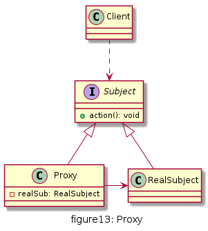

# 代理

给某一个对象提供一个代理或占位符，并由代理对象来控制对原对象的访问。


## UML

* 抽象主题角色(Subject)
* 代理主题角色(Proxy)
* 真实主题角色(RealSubject)


1. 远程代理(Remote Proxy)：为一个位于不同地址空间的对象提供一个本地的代理对象。不同的地址空间可以在相同或不同的主机中。
2. 虚拟代理(Virtual Proxy)：当创建一个对象需要消耗大量资源时，可以先创建一个消耗较少资源的虚拟代理来表示，当真正需要时再创建。
3. 保护代理(Protect Proxy)：给不同的用户提供不同的对象访问权限。
4. 缓冲代理(Cache Proxy)：为某一个目标操作的结果提供临时存储空间，以使更多用户可以共享这些结果。
5. 智能引用代理(Smart Reference Proxy)：当一个对象被引用时提供一些额外的操作，比如将对象被调用的次数记录下来等



## 优缺点

* 优点
  * 代理模式能够协调调用者和被调用者，降低系统耦合度
  * 客户端针对抽象主题角色编程，如果要增加或替换代理类，无需修改源代码，符合开闭原则，系统扩展性好

* 缺点
  * 增加了代理类和代理对象，增加了代理对象中的某些处理流程，可能会使得系统响应变慢
  * 有的代理模式（如远程代理）实现代码较为复杂


## 使用场景

* 当客户端对象需要访问远程主机中的对象 —— 可以使用远程代理
* 当需要用一个资源消耗较少的对象来代表一个资源消耗较多的对象 —— 虚拟代理
* 当需要限制不同用户对一个独享的访问权限 —— 保护代理
* 当需要为一个频繁访问的操作结果提供临时存储空间 —— 缓冲代理
* 当需要为一个对象的访问提供一些额外的操作 —— 智能引用代理


## 用例

以前春运时,火车票一票难求,当时黄牛党应运而生, 购票人向黄牛购票, 黄牛最终从售票点起票后,再交易给购票人,其中购票人不需要到售票点排队购票,省时省力,只需多付些手续费.

[code](../code/13_proxy)

```c++
// seller_types.h
#pragma once
#include <iostream>
#include <string>
using namespace std;

class Seller {
public:
	virtual int lookupPrice(string from,string to) = 0;
};

class TrainticketSeller :public Seller {
public:
	int lookupPrice(string from, string to)  {		
		return 100;
	}
};

class TicketScalper :public Seller {
public:
	TicketScalper():m_realSeller(new TrainticketSeller){

	}
	int lookupPrice(string from, string to) {
		int originalPrice = m_realSeller->lookupPrice(from, to);
		cout << "\nTicket [" << from << " - " << to << "] orignal price:" << originalPrice << endl;
		int addPrice = 10;
		return (originalPrice+addPrice);
	}
private:
	Seller* m_realSeller;
};
```

```c++
// client.cpp
#include "seller_types.h"
using namespace std;

int main() {

	Seller* seller = new TicketScalper();
	string from = "Shanghai", to = "NanJing";
	cout << "What is the price of ticket [" << from << " - " << to << "] ?";
	int price =  seller->lookupPrice(from, to);
	cout << "After addition fee 10, the ticket price is "<<price << endl;
	return 0;
}
```