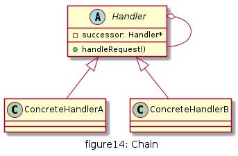
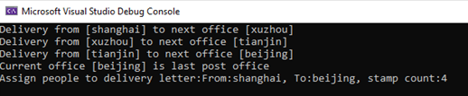

# 责任链

避免将一个请求的发送者和接收者耦合在一起，让多个对象都有机会处理请求。将接收请求的对象连接成一条链，并且沿着这条链传递请求，直到有一个对象能够处理它为止。


## UML

* Handler(抽象处理者): 抽象处理者一般为抽象类，声明了一个处理请求的接口handleRequest()，定义了一个抽象处理者类型的对象，作为其对下家的引用，通过该引用可以形成一条责任链
* ConcreteHandler(具体处理者): 是抽象处理者的子类，实现了处理请求的接口。在具体的实现中，如果该具体处理者能够处理该请求，就处理它，否则将该请求转发给后继者。具体处理者可以访问下一个对象



## 优缺点

* 优点
  * 将请求的接收者和处理者解耦，客户端无需知道具体处理者，只针对抽象处理者编程，简化了客户端编程过程，降低系统耦合度
  * 在系统中增加一个新的处理者时，只需要继承抽象处理者，重新实现handleRequest()接口，无需改动原有代码，符合开闭原则
  * 给对象分配职责时，职责链模式赋予系统更多灵活性

* 缺点
  * 请求没有一个明确的接收者，有可能遇到请求无法响应的问题
  * 比较长的职责链，其处理过程会很长
  * 建立职责链的工作是在客户端进行，如果建立不当，可能导致循环调用或者调用失败


## 使用场景

* 有多个对象处理同一个请求，具体由谁来处理是在运行时决定，客户端只需发出请求到职责链上，而无需关心具体是谁来处理
* 可动态指定一组对象处理请求，客户端可以动态创建职责链来处理请求，还可以改变职责链中各个处理者之间的上下级关系

## 用例

普通的信件寄送每到一个邮局都会盖上邮戳后派送到下一邮局,直到收件人直属的邮局派送

[code](../code/14_chain)

```c++
// post_offices.h
#pragma once
#include <string>
#include <iostream>
using namespace std;

struct Letter
{
	string sender;
	string receiver;
	int stamp_count;
	string toInfo() {
		return "From:"+ sender+", To:"+receiver+", stamp count:"+ to_string(stamp_count);
	}
};

class PostOffice {
public:
	explicit PostOffice(string name) :m_officeName(name) {
		this->m_next = nullptr;
	}
	virtual void stamp(Letter& letter) {
		letter.stamp_count = letter.stamp_count + 1;
	}
	virtual void delivery(Letter& letter) {
		stamp(letter);

		if (m_next) {
			cout << "Delivery from [" << m_officeName << "] to next office [" << m_next->m_officeName <<"]"<< endl;
			m_next->delivery(letter);
		}
		else {
			cout << "Current office [" << m_officeName << "] is last post office" << endl;
		}
	}
	virtual void setNext(PostOffice* next) {
		this->m_next = next;
	}
private:
	PostOffice* m_next;
	string m_officeName;
};

class FirstPostOffice : public PostOffice {
public:
	FirstPostOffice(string name) :PostOffice(name) {

	}
	void stamp(Letter& letter) {
		letter.stamp_count = 1;
	}
};

class MiddlePostOffice : public PostOffice {
public:
	MiddlePostOffice(string name) :PostOffice(name) {}
};

class LastPostOffice : public PostOffice {
public:
	LastPostOffice(string name) : PostOffice(name) {

	}
	void setNext(PostOffice* next) {
		cout << "This is last post office, no next station." << endl;
	}
	void delivery(Letter& letter) {
		PostOffice::delivery(letter);
		cout << "Assign people to delivery letter:" << letter.toInfo() << endl;
	}
};
```

```c++
// client.cpp
#include "post_offices.h"

int main() {
	// create letter
	Letter myLetter = {"shanghai","beijing",0};

	// set up post office
	FirstPostOffice PO1("shanghai");
	MiddlePostOffice PO2("xuzhou");
	MiddlePostOffice PO3("tianjin");
	LastPostOffice PO4("beijing");

	// set chain between offices
	PO1.setNext(&PO2);
	PO2.setNext(&PO3);
	PO3.setNext(&PO4);

	// submit all letter to first post office to handle
	PO1.delivery(myLetter);
	
	return 0;
}
```

