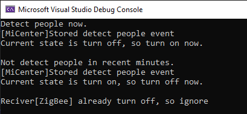

# 命令

将一个请求封装为一个对象，从而可用不同的请求对客户进行参数化，对请求排队或者记录请求日志，以及支持可撤销的操作。


## UML

* Command(抽象命令类): 是一个抽象类，声明了用于执行命令的接口execute()
* ConcreteCommnad(具体命令类): 具体的命令类，实现了执行命令的接口execute()，它对应具体的接收者对象，将接收者（Receiver）的动作action()绑定其中。在execu()方法中将调用接收者的动作action()
* Invoker(调用者): 请求的发送者，通过命令对象来执行请求。一个调用者不需要在设计时确定其接收者，所以调用者通过聚合，与命令类产生关联
* Receiver(接收者): 实现处理请求的具体操作（action）


## 优缺点

* 优点
  * 降低系统耦合度，将命令的请求者与接收者分离解耦，请求者和发送者不存在直接关联，各自独立互不影响
  * 便于扩展：新的命令很容易加入到系统中，且符合开闭原则
  * 较容易实现命令队列或宏命令
  * 为请求的撤销和回复操作提供了一种设计实现方案

* 缺点
  * 命令模式可能导致系统中有过多的具体命令类，增加了系统中对象的数量


## 使用场景

* 系统需要将请求发送者和接收者解耦，使得发送者和接收者互不影响
* 系统需要在不同时间指定请求、将请求排队和执行请求
* 系统需要支持命令的撤销和恢复操作
* 系统需要将一组操作组合在一起形成宏命令


## 用例

小米智能家居有以下应用场景:
下班回家,打开门, 人体感应器识别到人体,发送消息到小米网关,网关打开智能插座,点亮灯

[code](../code/15_command)

```c++
// command_types.h
#pragma once
#include <iostream>
#include <list>
using namespace std;

class Command {
public:
	virtual void execute() = 0;
};

class Receiver {
public:
	virtual void action() = 0;
};

class Invoker {
public:
	virtual void invoke() = 0;
};

class MiCenter : public Receiver {
public:
	void action() {
		cout << "[MiCenter]Stored detect people event" << endl;
	}
};

class ZigBee :public Receiver {
public:
	ZigBee() :state(false) {}
	void action() {
		if (state) {
			cout << "Current state is turn on, so turn off now.\n" << endl;
		}
		else {
			cout << "Current state is turn off, so turn on now.\n" << endl;
		}
		state = !state;
	}
	bool getState() {
		return state;
	}
private:
	bool state;
};

class SendMessage : public Command {
public:
	SendMessage(Receiver* receiver,bool hasPerson) :m_hasPerson(hasPerson),m_receiver(receiver) {

	}
	void execute() {
		cout << (m_hasPerson?"Detect people now.":"Not detect people in recent minutes.")<< endl;
		if (m_receiver)
			m_receiver->action();
	}
private:
	bool m_hasPerson;
	Receiver* m_receiver;
};

class TurnOn : public Command {
public:
	TurnOn(Receiver* receiver) :m_receiver(receiver) {

	}
	void execute() {
		if (m_receiver) {
			ZigBee* receiver = static_cast<ZigBee*>(m_receiver);
			if (receiver && receiver->getState() == false)
				m_receiver->action();
			else
				cout << "Reciver[ZigBee] already turn on, so ignore" << endl;
		}
			
	}
private:
	Receiver* m_receiver;
};

class TurnOff : public Command {
public:
	TurnOff(Receiver* receiver) :m_receiver(receiver) {

	}
	void execute() {
		if (m_receiver) {
			ZigBee* receiver = static_cast<ZigBee*>(m_receiver);
			if (receiver && receiver->getState())
				m_receiver->action();
			else
				cout << "Reciver[ZigBee] already turn off, so ignore" << endl;
		}
	}
private:
	Receiver* m_receiver;
};

class BodySensor : public Invoker {
public:
	BodySensor(list<Command*>& cmdlist):cmdlist_ptr(cmdlist){}

	void invoke() {		
		list<Command*>::const_iterator iter = cmdlist_ptr.begin();
		while (iter != cmdlist_ptr.end()) {
			(*iter)->execute();
			iter++;
		}
	}
private:
	list<Command*> cmdlist_ptr;
};
```

```c++
// client.cpp
#include "command_types.h"

int main() {

	Receiver* reciver1 = new MiCenter;
	Receiver* reciver2 = new ZigBee;

	list<Command*> list;

	Command* command1 = new SendMessage(reciver1,true);
	Command* command2 = new TurnOn(reciver2);
	Command* command3 = new SendMessage(reciver1, false);
	Command* command4 = new TurnOff(reciver2);
	Command* command5 = new TurnOff(reciver2);
	list.push_back(command1);
	list.push_back(command2);
	list.push_back(command3);
	list.push_back(command4);
	list.push_back(command5);

	Invoker* invoker = new BodySensor(list);
	invoker->invoke();
	return 0;
}
```

