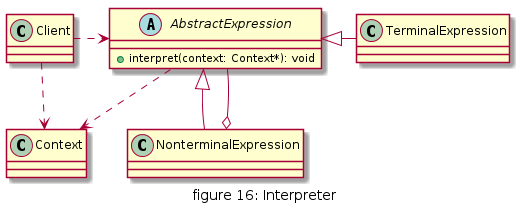
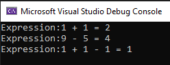

# 解释器

给定一个语言，定义它的文法的一种表示，并定义一个解释器，这个解释器使用该表示来解释语言中的句子

## UML

* AbstractExpression(抽象表达式): 声明了抽象的解释操作interpret()，是所有终结符表达式和非终结符表达式的基类
* TerminalExpression(终结符表达式): 终结符是文法规则的组成元素中最基本的语言单位，不能再分解
* NonterminalExpression(非终结符表达式): 实现了文法规则中非终结符的解释操作，因为非终结符表达式同样可以包含终结符表达式，所以终结符表达式可以是非终结符表达式的成员
* Context(环境类): 即上下文类，用于存储解释器之外的一些全局信息



## 优缺点

* 优点
  * 易于改变和扩展文法，在解释器中使用类表示语言的文法规则，可以通过继承等机制类改变或扩展文法
  * 每一条文法规则都可以表示为一个类，因此可以方便地实现一个简单的语言
  * 如果要增加新的解释表达式，只需增加一个新的终结符表达式或非终结符表达式类，无需修改原有代码，符合开闭原则

* 缺点
  * 对于复杂文法难以维护
  * 执行效率低，因为解释器模式中有大量循环和递归调用


## 使用场景

* 一些重复出现的问题可以用一种简单的语言进行表达
* 一个语言的文法较为简单
* 不考虑执行效率的问题时可以使用解释器模式


## 用例

10进制的加减简单表达式:

* 1 + 1
* 9 - 5
* 1 + 1 - 1


[code](../code/16_interpreter)

```c++
// expression_type.h
#pragma once
#include <string>
#include <iostream>
#include <vector>
using namespace std;

class AbstractNode {
public:
	virtual string interpret() = 0;
};

class ValueNode : public AbstractNode {
public:
	ValueNode() :m_val(0) {}
	ValueNode(int val) :m_val(val) {}
	string interpret() {
		return std::to_string(m_val);
	}

private:
	int m_val;
};

class OperationNode : public AbstractNode {
public:
	OperationNode() :m_oper("+") {}
	OperationNode(string val) :m_oper(val) {}
	string interpret() {
		return m_oper;
	}

private:
	string m_oper;
};

class SimpleExpression :public AbstractNode {
public:
	SimpleExpression() :m_leftNode(nullptr), m_operNode(nullptr), m_rightNode(nullptr) {}
	SimpleExpression(AbstractNode* left, AbstractNode* operNode, AbstractNode* right) :
		m_leftNode(left), m_operNode(operNode), m_rightNode(right) {}
	string interpret() {
		if (m_operNode && m_leftNode && m_rightNode) {
			string operation = m_operNode->interpret();
			string valL = m_leftNode->interpret();
			string valR = m_rightNode->interpret();
			if (operation == "+") {
				return std::to_string(stoi(valL) + stoi(valR));
			}
			else if (operation == "-") {
				return std::to_string((stoi(valL) - stoi(valR)));
			}
		}
		return "0";
	}
private:
	AbstractNode* m_leftNode, * m_rightNode, * m_operNode;
};

class Context {
public:
	Context();
	Context* input(string expression);
	Context* interpret();
	string output();
	void showOutput();
private:
	void splitString(const string& s, vector<string>& v, const string& c);
	string m_input;
	string m_result;
};
```

```c++
// expression_type.cpp
#include "expression_type.h"


Context::Context() :m_input(""), m_result("") {

}

Context* Context::input(string input) {
	m_input = input;
	return this;
}

Context* Context::interpret() {
	vector<string> list;
	splitString(m_input, list, " ");
	AbstractNode* nodes[4];
	for (int i = 0; i < list.size() - 2; i += 2) {
		nodes[0] = new ValueNode(stoi(list.at(i)));
		nodes[1] = new OperationNode(list.at(i + 1));
		nodes[2] = new ValueNode(stoi(list.at(i + 2)));
		nodes[3] = new SimpleExpression(nodes[0], nodes[1], nodes[2]);
		list[i + 2] = nodes[3]->interpret();
	}
	this->m_result = list.back();
	return this;
}

string Context::output() {
	return m_result;
}

void Context::showOutput() {
	cout << "Expression:" << this->m_input << " = " << output() << endl;
}

void Context::splitString(const string& s, vector<string>& v, const string& c)
{
	string::size_type pos1, pos2;
	pos2 = s.find(c);
	pos1 = 0;
	while (string::npos != pos2)
	{
		v.push_back(s.substr(pos1, pos2 - pos1));

		pos1 = pos2 + c.size();
		pos2 = s.find(c, pos1);
	}
	if (pos1 != s.length())
		v.push_back(s.substr(pos1));
}
```

```c++
// client.cpp
#include "expression_type.h"

int main() {
	Context ctx;
	ctx.input("1 + 1")->interpret()->showOutput();
	ctx.input("9 - 5")->interpret()->showOutput();
	ctx.input("1 + 1 - 1")->interpret()->showOutput();
}
```

