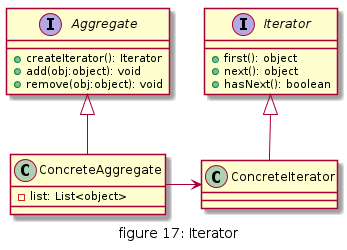
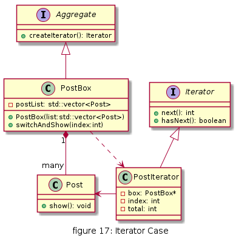
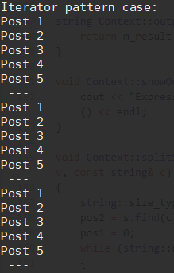

# 迭代器

提供一个对象来顺序访问聚合对象中的一系列数据，而不暴露聚合对象的内部表示


## UML

* 抽象迭代器(Iterator)角色：定义访问和遍历聚合元素的接口，通常包含 hasNext()、first()、next() 等方法。
* 具体迭代器(ConcreteIterator)角色：实现抽象迭代器接口中所定义的方法，完成对聚合对象的遍历，记录遍历的当前位置
* 抽象聚合(Aggregate)角色：定义存储、添加、删除聚合对象以及创建迭代器对象的接口。
* 具体聚合(ConcreteAggregate)角色：实现抽象聚合类，返回一个具体迭代器的实例。



## 优缺点

* 优点
  * 访问一个聚合对象的内容而无须暴露它的内部表示
  * 遍历任务交由迭代器完成，这简化了聚合类
  * 它支持以不同方式遍历一个聚合，甚至可以自定义迭代器的子类以支持新的遍历   
  * 迭代器模式中引入抽象层，易于增加新的迭代器类，便于扩展，符合开闭原则


* 缺点
  * 增加了类的个数，这在一定程度上增加了系统的复杂性


## 使用场景

* 访问一个聚合对象而无需暴露它的内部结构
* 需要为一个聚合对象提供多种遍历方法

## 用例

现在机械可滚动的广告箱生活中还是能见到,比如公交站台上可滚动的广告箱;
用户可以看到上面展示的广告宣传画布每隔一定时间滚动切换至下一幅广告. 用户并不关心这些广告是怎么存储以及结构是啥, 用户关注的是周期展示的广告画.



[code](../code/17_iterator)


```c++
// iterator_types.h

#pragma once
#include <iostream>
#include <string>
#include <vector>

class Iterator{
public:
    virtual int next()=0;
    virtual bool hasNext()=0;
};

class Aggregate{
public:
    virtual Iterator* createIterator()=0;
};

class Post{
public:
    Post(std::string cont):m_content(cont){

    }
    void show(){
        std::cout<<m_content<<std::endl;
    }
private:
    std::string m_content;
};

class PostBox;
class PostIterator: public Iterator{
public:
    PostIterator(PostBox* bx);
    int next();
    bool hasNext();
private:
    PostBox* box;
    int index;
    int total;
};


class PostBox: public Aggregate{
public:    
    PostBox(std::vector<Post*> list):postList(list){

    }
    Iterator* createIterator();
    void switchAndShow(int index);
    int totalSize();
private:
    std::vector<Post*> postList;    
};
```

```c++
// iterator_types.cpp
#include "iterator_types.h"

PostIterator::PostIterator(PostBox* bx):box(bx),index(0),total(1){
    if(bx){
        this->total = bx->totalSize();
    }
}

int PostIterator::next(){
    int temp = this->index;
    this->index = (++this->index) % this->total;
    return temp;
}

bool PostIterator::hasNext(){

    return true;
}

// PostBox
Iterator* PostBox::createIterator(){

    return new PostIterator(this);
}

void PostBox::switchAndShow(int index){
    this->postList.at(index)->show();
}

int PostBox::totalSize(){
    return this->postList.size();
}
```

```c++
// client.cpp
#include <iostream>

#include "iterator_types.h"

void mysleep(long count);

int main(){
    std::cout<<"Iterator pattern case:"<<std::endl;
    std::vector<Post*> list;
    list.push_back(new Post("Post 1"));
    list.push_back(new Post("Post 2"));
    list.push_back(new Post("Post 3"));
    list.push_back(new Post("Post 4"));
    list.push_back(new Post("Post 5"));
    
    const int POST_SIZE = list.size();
    PostBox* box = new PostBox(list);
    Iterator* iter = box->createIterator();

    while(iter->hasNext()){        
        int postIndex = iter->next();        
        box->switchAndShow(postIndex);
        if(postIndex == (POST_SIZE-1)){
            std::cout<< " --- " <<std::endl;
        }
        mysleep(50000000);
    }

    return 0;
}

void mysleep(long count){
    
    for(long i=0;i<count;i++){
        
    }
}
```

