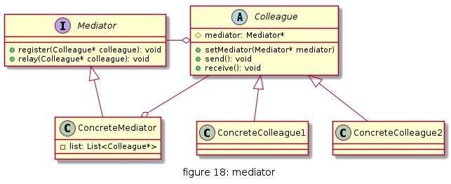
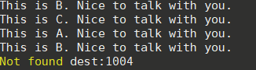

# 中介者

定义一个中介对象来封装一系列对象之间的交互，使原有对象之间的耦合松散，且可以独立地改变它们之间的交互。中介者模式又叫调停模式，它是迪米特法则的典型应用。


## UML


* 抽象中介者（Mediator）角色：它是中介者的接口，提供了同事对象注册与转发同事对象信息的抽象方法。
* 具体中介者（Concrete Mediator）角色：实现中介者接口，定义一个 List 来管理同事对象，协调各个同事角色之间的交互关系，因此它依赖于同事角色。
* 抽象同事类（Colleague）角色：定义同事类的接口，保存中介者对象，提供同事对象交互的抽象方法，实现所有相互影响的同事类的公共功能。
* 具体同事类（Concrete Colleague）角色：是抽象同事类的实现者，当需要与其他同事对象交互时，由中介者对象负责后续的交互。




## 优缺点

* 优点
  * 简化了对象之间的交互，通过中介者，对象之间的多对多关系就简化了相对更简单的一对多关系；
  * 可将各个同事对象解耦，利于各个同事之间的松散耦合，可独立地改变和复用每一个同事对象，增加新的中介者和同事都比较方便，符合开闭原则；
  * 可减少子类生成，将原本分布于多个对象之间的行为封装在一起，只需生成新的具体中介者类就可以改变这些行为。

* 缺点
   * 具体中介者类中包含了大量与同事之间交互的细节和逻辑，可能使得中介者类很复杂以至于难以管理维护


## 使用场景


* 当对象之间存在复杂的网状结构关系而导致依赖关系混乱且难以复用时。
* 当想创建一个运行于多个类之间的对象，又不想生成新的子类时。


## 用例

经常在旧上海的电视剧中看到这样打电话的场景, A拿起电话,手摇拨号盘后,稍等片刻, 说到 "帮我接xx公馆", 然后接线员, 接通目的地的线路, 然后 A就可以和B通话了. 这里 A和B就是 Colleague, 接线员所在的场所即为话务中介

[code](../code/18_mediator)

```c++
// mediator_types.h
#pragma once

#include <iostream>
#include <string>
#include <vector>

using namespace std;

class Colleague;
class Mediator{
public:
    virtual void registerColleague(Colleague* colleague) = 0;
    virtual Colleague* pick(string number) =0;
};

class Colleague{
public:
    Colleague(string number,Mediator* mediator):myNumber(number),callCeneter(mediator){}
    virtual void dial(string number);
    virtual void reply() =0;
    string getNumber();
private:
    Mediator* callCeneter;
    string myNumber;
};

class CallCenter : public Mediator{
public:
    void registerColleague(Colleague* colleague);
    Colleague* pick(string number);    
private:
    vector<Colleague*> list;
};

class UserA : public Colleague{
public:
    UserA(string number,Mediator* mediator): Colleague(number,mediator){}
    void reply();
};

class UserB : public Colleague{
public:
    UserB(string number,Mediator* mediator): Colleague(number,mediator){}
    void reply();
};

class UserC : public Colleague{
public:
    UserC(string number,Mediator* mediator): Colleague(number,mediator){}
    void reply();
};
```

```c++
// mediator_types.cpp
#include "mediator_types.h"

void Colleague::dial(string number){
    if(!callCeneter){
        cout<<"Please set call center"<<endl;
        return;
    }
    Colleague* dest = callCeneter->pick(number);
    if(dest){
        dest->reply();
    }else{
        cout<<"Not found dest:"<<number<<endl;
    }
}

string Colleague::getNumber(){
    return this->myNumber;
}

void CallCenter::registerColleague(Colleague* colleague){
    list.push_back(colleague);
}

Colleague* CallCenter::pick(string number){
    Colleague* ret = NULL;
    auto it = list.begin();
    while(it!=list.end()){
        if(number == (*it)->getNumber()){
            ret =  (*it);
            break;
        }
        it++;
    }
    return ret;
}

void UserA::reply(){
    cout<<"This is A. Nice to talk with you."<<endl;
}

void UserB::reply(){
    cout<<"This is B. Nice to talk with you."<<endl;
}

void UserC::reply(){
    cout<<"This is C. Nice to talk with you."<<endl;
}
```

```c++
// client.cpp
#include "mediator_types.h"

int main(){
    Mediator* callCeneter = new CallCenter();

    Colleague* userA = new UserA("1001",callCeneter);
    Colleague* userB = new UserB("1002",callCeneter);
    Colleague* userC = new UserC("1003",callCeneter);

    callCeneter->registerColleague(userA);
    callCeneter->registerColleague(userB);
    callCeneter->registerColleague(userC);

    userA->dial("1002");
    userA->dial("1003");

    userC->dial("1001");
    userC->dial("1002");
    userC->dial("1004");

    return 0;
}
```

