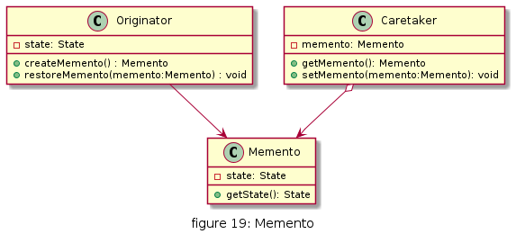
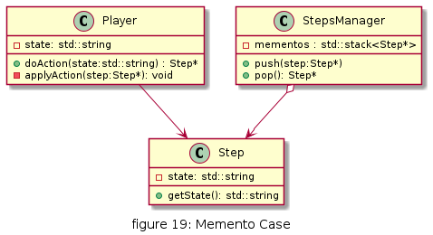
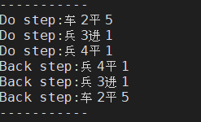

# 备忘录

在不破坏封装性的前提下，捕获一个对象的内部状态，并在该对象之外保存这个状态，以便以后当需要时能将该对象恢复到原先保存的状态。该模式又叫快照模式

备忘录模式能记录一个对象的内部状态，当用户后悔时能撤销当前操作，使数据恢复到它原先的状态。

## UML

* 发起人（Originator）角色：记录当前时刻的内部状态信息，提供创建备忘录和恢复备忘录数据的功能，实现其他业务功能，它可以访问备忘录里的所有信息。
* 备忘录（Memento）角色：负责存储发起人的内部状态，在需要的时候提供这些内部状态给发起人。
* 管理者（Caretaker）角色：对备忘录进行管理，提供保存与获取备忘录的功能，但其不能对备忘录的内容进行访问与修改。



## 优缺点

* 优点
 * 提供了一种可以恢复状态的机制。当用户需要时能够比较方便地将数据恢复到某个历史的状态。
 * 实现了内部状态的封装。除了创建它的发起人之外，其他对象都不能够访问这些状态信息。
 * 简化了发起人类。发起人不需要管理和保存其内部状态的各个备份，所有状态信息都保存在备忘录中，并由管理者进行管理，这符合单一职责原则。

* 缺点
 * 资源消耗大。如果要保存的内部状态信息过多或者特别频繁，将会占用比较大的内存资源。


## 使用场景

* 需要保存与恢复数据的场景，如玩游戏时的中间结果的存档功能。
* 需要提供一个可回滚操作的场景，如 Word、记事本、Photoshop，Eclipse 等软件在编辑时按 Ctrl+Z 组合键，还有数据库中事务操作。


## 用例

在常见的象棋或棋类游戏中,常常允许悔棋. 



[code](../code/19_memento)

```c++
// memento_types.h
#ifndef __MEMENTO_TYPES_H__
#define __MEMENTO_TYPES_H__

#include <iostream>
#include <string>
#include <stack>
using namespace std;

class Step
{
public:
    Step(std::string state) : state_(state) {}
    ~Step() {}
    inline std::string getState()
    {
        return state_;
    }

private:
    std::string state_;
};

class Player
{
public:
    Player();
    ~Player();
    Step *doAction(std::string state);
    void applyAction(Step *step);

private:
    std::string state_;
};

class StepsManager
{
public:
    StepsManager();
    ~StepsManager();
    void push(Step *step);
    Step *pop();

private:
    std::stack<Step *> mementos;
};

#endif // __MEMENTO_TYPES_H__
```

```c++
// memento_types.cpp
#include "memento_types.h"

Player::Player()
{
}

Player::~Player()
{
}

Step *Player::doAction(std::string state)
{
    this->state_ = state;
    Step *step = new Step(this->state_);
    cout << "Do step:" << this->state_ << endl;
    return step;
}

void Player::applyAction(Step *step)
{
    if (step)
    {
        this->state_ = step->getState();
        cout << "Back step:" << this->state_ << endl;
    }
}

StepsManager::StepsManager()
{
}

StepsManager::~StepsManager()
{
}

void StepsManager::push(Step *step)
{
    if (step)
    {
        mementos.push(step);
    }
}

Step *StepsManager::pop()
{
    Step *step = NULL;
    if (mementos.empty())
        return step;
    step = mementos.top();
    mementos.pop();
    return step;
}

```

```c++
#include "memento_types.h"

int main()
{
    Player player1;
    StepsManager stepManager;
    cout << "-----------" << endl;
    stepManager.push(player1.doAction("车2平5"));
    stepManager.push(player1.doAction("兵3进1"));
    stepManager.push(player1.doAction("兵4平1"));

    player1.applyAction(stepManager.pop());
    player1.applyAction(stepManager.pop());
    player1.applyAction(stepManager.pop());
    cout << "-----------" << endl;
    return 0;
}

```
