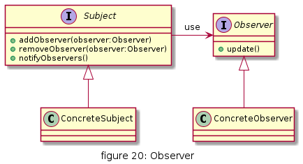
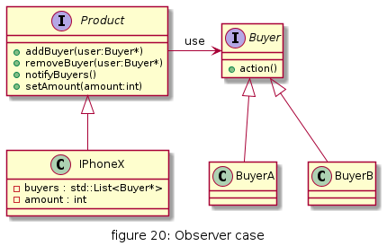
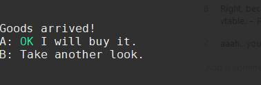

# Observer

多个对象间存在一对多的依赖关系，当一个对象的状态发生改变时，所有依赖于它的对象都得到通知并被自动更新。这种模式有时又称作发布-订阅模式、模型-视图模式，它是对象行为型模式。

## UML

* Subject: 抽象主题（抽象被观察者）角色，抽象主题角色把所有观察者对象保存在一个集合里，每个主题都可以有任意数量的观察者，抽象主题提供一个接口，可以增加和删除观察者对象。
* ConcreteSubject：具体主题（具体被观察者）角色，该角色将有关状态存入具体观察者对象，在具体主题的内部状态发生改变时，给所有注册过的观察者发送通知。
* Observer：抽象观察者角色，是观察者者的抽象类，它定义了一个更新接口，使得在得到主题更改通知时更新自己。
* ConcrereObserver：具体观察者角色，实现抽象观察者定义的更新接口，以便在得到主题更改通知时更新自身的状态。

## 优缺点

* 优点
  * 降低了目标与观察者之间的耦合关系，两者之间是抽象耦合关系。符合依赖倒置原则。
  * 目标与观察者之间建立了一套触发机制

* 缺点
  * 目标与观察者之间的依赖关系并没有完全解除，而且有可能出现循环引用。
  * 当观察者对象很多时，通知的发布会花费很多时间，影响程序的效率。

## 使用场景
* 对象间存在一对多关系，一个对象的状态发生改变会影响其他对象。
* 当一个抽象模型有两个方面，其中一个方面依赖于另一方面时，可将这二者封装在独立的对象中以使它们可以各自独立地改变和复用。
* 实现类似广播机制的功能，不需要知道具体收听者，只需分发广播，系统中感兴趣的对象会自动接收该广播。
* 多层级嵌套使用，形成一种链式触发机制，使得事件具备跨域（跨越两种观察者类型）通知。

## 用例

京东商城商品到货通知, 京东app上可以在商品缺货上设置到货通知.

[code](../code/20_observer)

