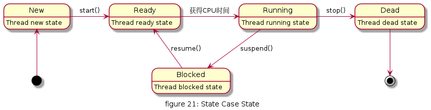

# State

对有状态的对象，把复杂的“判断逻辑”提取到不同的状态对象中，允许状态对象在其内部状态发生改变时改变其行为。

在GOF的《设计模式:可复用面向对象软件的基础》一书中对状态模式是这样说的：允许一个对象在其内部状态改变时改变它的行为。对象看起来似乎修改了它的类。
状态模式的重点在于状态转换，很多时候，对于一个对象的状态，我们都是让这个对象包含一个状态的属性，这个状态属性记录着对象的具体状态，根据状态的不同使用分支结构来执行不同的功能，类中存在大量的结构类似的分支语句，变得难以维护和理解。
状态模式消除了分支语句，就像工厂模式消除了简单工厂模式的分支语句一样，将状态处理分散到各个状态子类中去，每个子类集中处理一种状态，这样就使得状态的处理和转换清晰明确。


## UML

* 环境类（Context）角色：也称为上下文，它定义了客户端需要的接口，内部维护一个当前状态，并负责具体状态的切换。
* 抽象状态（State）角色：定义一个接口，用以封装环境对象中的特定状态所对应的行为，可以有一个或多个行为。
* 具体状态（Concrete State）角色：实现抽象状态所对应的行为，并且在需要的情况下进行状态切换。


## 优缺点

* 优点
  * 结构清晰，状态模式将与特定状态相关的行为局部化到一个状态中，并且将不同状态的行为分割开来，满足“单一职责原则”。
  * 将状态转换显示化，减少对象间的相互依赖。将不同的状态引入独立的对象中会使得状态转换变得更加明确，且减少对象间的相互依赖。
  * 状态类职责明确，有利于程序的扩展。通过定义新的子类很容易地增加新的状态和转换。

* 缺点
  * 状态模式的使用必然会增加系统的类与对象的个数。
  * 状态模式的结构与实现都较为复杂，如果使用不当会导致程序结构和代码的混乱。
  * 状态模式对开闭原则的支持并不太好，对于可以切换状态的状态模式，增加新的状态类需要修改那些负责状态转换的源码，否则无法切换到新增状态，而且修改某个状态类的行为也需要修改对应类的源码。


## 使用场景

* 当控制一个对象状态转换的条件表达式过于复杂时的情况。把状态的判断逻辑转移到表示不同状态的一系列类当中，可以把复杂的判断逻辑简化。
* 当一个对象的行为取决于它的状态，并且它必须在运行时根据状态改变它的行为时，就可以考虑使用状态模式了


## 用例

多线程存在 5 种状态，分别为新建状态、就绪状态、运行状态、阻塞状态和死亡状态，各个状态当遇到相关方法调用或事件触发时会转换到其他状态，其状态转换规律如图`figure 21: State Case State`所示。



类图如下:


[code](../code/21_state)


```c++
// state_types.h
#ifndef __STATE_TYPES_H__
#define __STATE_TYPES_H__

#include <iostream>
class ThreadContext;
enum ThreadStateName
{
    NEW = 0,
    READY,
    RUNNING,
    BLOCKED,
    DEAD
};

class ThreadState
{
public:
    ThreadState(ThreadStateName name):stateName(name)
    {
        std::cout << "Current Thread state:" << stateName << std::endl;
    }
    virtual ~ThreadState() {}
    inline ThreadStateName getStateName()
    {
        return stateName;
    }

protected:
    ThreadStateName stateName;
};

class NewState : public ThreadState
{
public:
    NewState() : ThreadState(::NEW) {}
    void start(ThreadContext *context);
};

class ReadyState : public ThreadState
{
public:
    ReadyState() : ThreadState(READY) {}
    void acquire(ThreadContext *context);
};

class RunningState : public ThreadState
{
public:
    RunningState() : ThreadState(RUNNING) {}
    void suspend(ThreadContext *context);
    void stop(ThreadContext *context);
};

class BlockedState : public ThreadState
{
public:
    BlockedState() : ThreadState(BLOCKED) {}
    void resume(ThreadContext *context);
};

class DeadState : public ThreadState
{
public:
    DeadState() : ThreadState(::DEAD) {}
};

class ThreadContext
{
public:
    ThreadContext() : state(new NewState()) {}
    void changeState(ThreadState *state);
    ThreadState *getState();
    void start();
    void acquireCPU();
    void suspend();
    void stop();
    void resume();

private:
    ThreadState *state;
};
#endif // __STATE_TYPES_H__
```

```c++
// state_types.cpp
#include "state_types.h"

void NewState::start(ThreadContext *context)
{
    std::cout << "call NewState::start()" << std::endl;
    if (stateName == ::NEW)
    {
        if (context)
            context->changeState(new ReadyState());
    }
    else
    {
        std::cout << "Cannot call NewState::start() since current state is not [NEW]" << std::endl;
    }
}

void ReadyState::acquire(ThreadContext *context)
{
    std::cout << "call ReadyState::acquire()" << std::endl;
    if (stateName == ::READY)
    {
        if (context)
            context->changeState(new RunningState());
    }
    else
    {
        std::cout << "Cannot call ReadyState::acquire() since current state is not [READY]" << std::endl;
    }
}

void RunningState::suspend(ThreadContext *context)
{
    std::cout << "call RunningState::suspend()" << std::endl;
    if (stateName == ::RUNNING)
    {
        if (context)
            context->changeState(new BlockedState());
    }
    else
    {
        std::cout << "Cannot call RunningState::suspend() since current state is not [RUNNING]" << std::endl;
    }
}

void RunningState::stop(ThreadContext *context)
{
    std::cout << "call RunningState::stop()" << std::endl;
    if (stateName == ::RUNNING)
    {
        if (context)
            context->changeState(new DeadState());
    }
    else
    {
        std::cout << "Cannot call RunningState::stop() since current state is not [RUNNING]" << std::endl;
    }
}

void BlockedState::resume(ThreadContext *context)
{
    std::cout << "call BlockedState::resume()" << std::endl;
    if (stateName == ::BLOCKED)
    {
        if (context)
            context->changeState(new ReadyState());
    }
    else
    {
        std::cout << "Cannot call BlockedState::resume() since current state is not [BLOCKED]" << std::endl;
    }
}

void ThreadContext::changeState(ThreadState *state)
{
    if (this->state)
    {
        delete this->state;
    }
    this->state = state;
}

ThreadState *ThreadContext::getState()
{
    return state;
}

void ThreadContext::start()
{
    if (state && state->getStateName() == ::NEW)
    {
        static_cast<NewState *>(state)->start(this);
    }
}

void ThreadContext::acquireCPU()
{
    if (state && state->getStateName() == ::READY)
    {
        static_cast<ReadyState *>(state)->acquire(this);
    }
}

void ThreadContext::suspend()
{
    if (state && state->getStateName() == ::RUNNING)
    {
        static_cast<RunningState *>(state)->suspend(this);
    }
}

void ThreadContext::stop()
{
    if (state && state->getStateName() == ::RUNNING)
    {
        static_cast<RunningState *>(state)->stop(this);
    }
}

void ThreadContext::resume()
{
    if (state && state->getStateName() == ::BLOCKED)
    {
        static_cast<BlockedState *>(state)->resume(this);
    }
}
```

```c++
// client.cpp
#include "state_types.h"

int main(){
    std::cout<<"------------------"<<std::endl;
    ThreadContext context;
    context.start();
    context.acquireCPU();
    context.suspend();
    context.resume();
    context.acquireCPU();
    context.stop();
    std::cout<<"------------------"<<std::endl;
    return 1;
}
```

