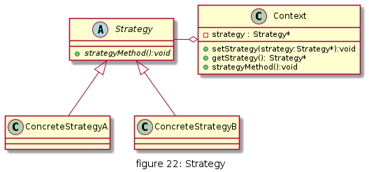
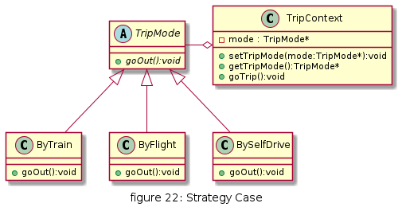
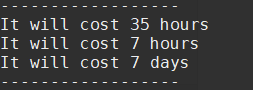

# Strategy

定义了一系列算法，并将每个算法封装起来，使它们可以相互替换，且算法的变化不会影响使用算法的客户。策略模式属于对象行为模式，它通过对算法进行封装，把使用算法的责任和算法的实现分割开来，并委派给不同的对象对这些算法进行管理。


## UML

* 抽象策略（Strategy）类：定义了一个公共接口，各种不同的算法以不同的方式实现这个接口，环境角色使用这个接口调用不同的算法，一般使用接口或抽象类实现。
* 具体策略（Concrete Strategy）类：实现了抽象策略定义的接口，提供具体的算法实现。
* 环境（Context）类：持有一个策略类的引用，最终给客户端调用



## 优缺点

* 优点
  * 多重条件语句不易维护，而使用策略模式可以避免使用多重条件语句，如 if...else 语句、switch...case 语句。
  * 策略模式提供了一系列的可供重用的算法族，恰当使用继承可以把算法族的公共代码转移到父类里面，从而避免重复的代码。
  * 策略模式可以提供相同行为的不同实现，客户可以根据不同时间或空间要求选择不同的。
  * 策略模式提供了对开闭原则的完美支持，可以在不修改原代码的情况下，灵活增加新算法。
  * 策略模式把算法的使用放到环境类中，而算法的实现移到具体策略类中，实现了二者的分离。

* 缺点
  * 客户端必须理解所有策略算法的区别，以便适时选择恰当的算法类。
  * 策略模式造成很多的策略类，增加维护难度。


## 使用场景

* 一个系统需要动态地在几种算法中选择一种时，可将每个算法封装到策略类中。
* 一个类定义了多种行为，并且这些行为在这个类的操作中以多个条件语句的形式出现，可将每个条件分支移入它们各自的策略类中以代替这些条件语句。
* 系统中各算法彼此完全独立，且要求对客户隐藏具体算法的实现细节时。
* 系统要求使用算法的客户不应该知道其操作的数据时，可使用策略模式来隐藏与算法相关的数据结构。
* 多个类只区别在表现行为不同，可以使用策略模式，在运行时动态选择具体要执行的行为。


## 用例

从上海到西藏拉萨旅游, 可以坐火车,飞机或者自驾.



[code](../code/22_strategy)

```c++
// strategy_types.h
#ifndef __STRATEGY_TYPES_H__
#define __STRATEGY_TYPES_H__

class TripMode
{
public:
    virtual ~TripMode() {}
    virtual void goOut() = 0;
};

class ByTrain : public TripMode
{
public:
    void goOut();
};

class ByFlight : public TripMode
{
public:
    void goOut();
};

class BySelfDrive : public TripMode
{
public:
    void goOut();
};

class TripContext
{
public:
    TripContext() : tripMode(nullptr) {}
    TripContext(TripMode *mode_) : tripMode(mode_) {}
    ~TripContext();
    void setTripMode(TripMode *mode);
    TripMode *getTripMode();
    void goTrip();

private:
    TripMode *tripMode;
};

#endif // __STRATEGY_TYPES_H__
```

```c++
// strategy_types.cpp
#include "strategy_types.h"
#include <iostream>

void ByTrain::goOut()
{
    std::cout << "It will cost 35 hours" << std::endl;
}

void ByFlight::goOut()
{
    std::cout << "It will cost 7 hours" << std::endl;
}

void BySelfDrive::goOut()
{
    std::cout << "It will cost 7 days" << std::endl;
}

TripContext::~TripContext()
{
    if (this->tripMode)
    {
        delete this->tripMode;
    }
}

void TripContext::setTripMode(TripMode *mode)
{
    if (this->tripMode)
    {
        delete this->tripMode;
    }
    this->tripMode = mode;
}

TripMode *TripContext::getTripMode()
{
    return this->tripMode;
}

void TripContext::goTrip()
{
    if (this->tripMode)
    {
        this->tripMode->goOut();
    }
}
```

```c++
// client.cpp
#include "strategy_types.h"
#include <iostream>

int main()
{
    std::cout << "------------------" << std::endl;
    TripContext context;
    context.setTripMode(new ByTrain());
    context.goTrip();
    context.setTripMode(new ByFlight());
    context.goTrip();
    context.setTripMode(new BySelfDrive());
    context.goTrip();

    std::cout << "------------------" << std::endl;
    return 1;
}
```

