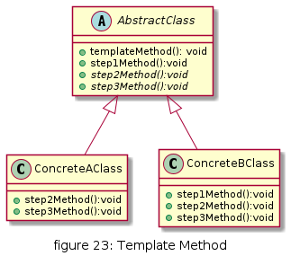

# Template Method

定义一个操作中的算法骨架，而将算法的一些步骤延迟到子类中，使得子类可以不改变该算法结构的情况下重定义该算法的某些特定步骤。


## UML

* AbstractClass 抽象模板类，负责给出一个算法的轮廓和骨架。它由一个模板方法和若干个基本方法构成。这些方法的定义如下:
  * 模板方法：定义了算法的骨架，按某种顺序调用其包含的基本方法。
  * 基本方法：是整个算法中的一个步骤，包含以下几种类型:
    * 抽象方法：在抽象类中声明，由具体子类实现。
    * 具体方法：在抽象类中已经实现，在具体子类中可以继承或重写它。
    * 钩子方法：在抽象类中已经实现，包括用于判断的逻辑方法和需要子类重写的空方法两种。
* ConcreteClass 具体实现类，实现抽象类中所定义的抽象方法和钩子方法，它们是一个顶级逻辑的一个组成步骤。



## 优缺点

* 优点
  * 实现了最大化代码复用。父类的模板方法和已实现的某些步骤会被子类继承而直接使用
  * 既统一了算法，也提供了很大的灵活性。父类的模板方法确保了算法的结构保持不变，同时由子类提供部分步骤的实现

* 缺点
  * 每一个不同的实现都需要一个子类实现，导致类的个数增加，使得系统更加庞大


## 使用场景

* 有多个子类共有的方法，且逻辑相同
* 重要的、复杂的方法，可以考虑作为模板方法


## 用例

开车上班分为 开车门, 启动, 行驶, 到达目的地, 熄火, 关车门


[code](../code/23_template)

```c++
// template_types.h
#ifndef __TEMPLATE_TYPES_H__
#define __TEMPLATE_TYPES_H__

#include <iostream>

class GoOfficeByCar
{
public:
    virtual ~GoOfficeByCar() {}
    /**
     * @brief template method, use final to forbbiden child class to override
     * 
     */
    virtual void action() final
    {
        openDoor();
        powerOn();
        drive();
        parking();
        powerOff();
        closeDoor();
    }
    virtual void openDoor() {std::cout<<"Unlock to open door."<<std::endl;}
    virtual void powerOn() = 0;
    virtual void drive() = 0;
    virtual void parking() = 0;
    virtual void powerOff() = 0;
    virtual void closeDoor() {std::cout<<"Lock to close door."<<std::endl;}
};

class GoOfficeByGolf : public GoOfficeByCar
{
public:
    GoOfficeByGolf(){std::cout<<"Today by car -- Golf."<<std::endl;}
    void powerOn();
    void drive();
    void parking();
    void powerOff();
};

class GoOfficeByXiaoMi : public GoOfficeByCar
{
public:
    GoOfficeByXiaoMi(){std::cout<<"Today by car -- Xiaomi."<<std::endl;}
    void powerOn();
    void drive();
    void parking();
    void powerOff();
};

#endif // __TEMPLATE_TYPES_H__
```

```c++
// template_types.cpp
#include "template_types.h"

void GoOfficeByGolf::powerOn() 
{
    std::cout<<"Insert key and manual power on."<<std::endl;
}

void GoOfficeByGolf::drive() 
{
    std::cout<<"Manual drive."<<std::endl;
}

void GoOfficeByGolf::parking() 
{
    std::cout<<"Manual parking."<<std::endl;
}

void GoOfficeByGolf::powerOff() 
{
    std::cout<<"Manual power off and pull key."<<std::endl;
}

void GoOfficeByXiaoMi::powerOn() 
{
    std::cout<<"No key and auto power on."<<std::endl;
}

void GoOfficeByXiaoMi::drive() 
{
    std::cout<<"Auto drive."<<std::endl;
}

void GoOfficeByXiaoMi::parking() 
{
    std::cout<<"Auto parking."<<std::endl;
}

void GoOfficeByXiaoMi::powerOff() 
{
    std::cout<<"Manual power off."<<std::endl;
}
```

```c++
// client.cpp
#include "template_types.h"
#include <iostream>

int main()
{
    std::cout << "------------------" << std::endl;
    GoOfficeByCar *byCar = new GoOfficeByGolf();
    if (byCar)
    {
        byCar->action();
        delete byCar;
    }
    byCar = new GoOfficeByXiaoMi();
    if (byCar)
    {
        byCar->action();
        delete byCar;
    }
    std::cout << "------------------" << std::endl;
    return 1;
}
```

