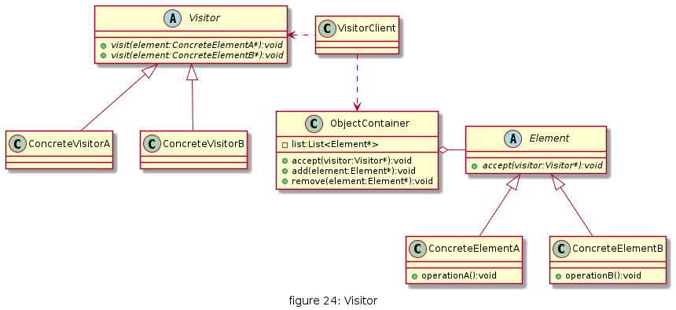
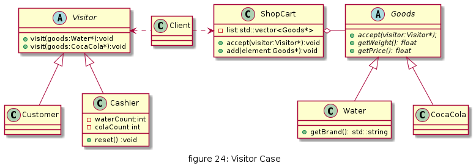
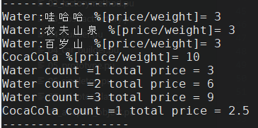

# Visitor

将作用于某种数据结构中的各元素的操作分离出来封装成独立的类，使其在不改变数据结构的前提下可以添加作用于这些元素的新的操作，为数据结构中的每个元素提供多种访问方式。它将对数据的操作与数据结构进行分离，是行为类模式中最复杂的一种模式。


## UML

* 抽象访问者（Visitor）角色：定义一个访问具体元素的接口，为每个具体元素类对应一个访问操作 visit() ，该操作中的参数类型标识了被访问的具体元素。
* 具体访问者（ConcreteVisitor）角色：实现抽象访问者角色中声明的各个访问操作，确定访问者访问一个元素时该做什么。
* 抽象元素（Element）角色：声明一个包含接受操作 accept() 的接口，被接受的访问者对象作为 accept() 方法的参数。
* 具体元素（ConcreteElement）角色：实现抽象元素角色提供的 accept() 操作，其方法体通常都是 visitor.visit(this) ，另外具体元素中可能还包含本身业务逻辑的相关操作。
* 对象结构（Object Structure）角色：是一个包含元素角色的容器，提供让访问者对象遍历容器中的所有元素的方法，通常由 List、Set、Map 等聚合类实现。



## 优缺点

* 优点
  * 扩展性好。能够在不修改对象结构中的元素的情况下，为对象结构中的元素添加新的功能。
  * 复用性好。可以通过访问者来定义整个对象结构通用的功能，从而提高系统的复用程度。
  * 灵活性好。访问者模式将数据结构与作用于结构上的操作解耦，使得操作集合可相对自由地演化而不影响系统的数据结构。
  * 符合单一职责原则。访问者模式把相关的行为封装在一起，构成一个访问者，使每一个访问者的功能都比较单一。

* 缺点
  * 增加新的元素类很困难。在访问者模式中，每增加一个新的元素类，都要在每一个具体访问者类中增加相应的具体操作，这违背了“开闭原则”。
  * 破坏封装。访问者模式中具体元素对访问者公布细节，这破坏了对象的封装性。
  * 违反了依赖倒置原则。访问者模式依赖了具体类，而没有依赖抽象类。

## 使用场景

* 对象结构中对象对应的类很少改变，但经常需要在此对象结构上定义新的操作。 
* 需要对一个对象结构中的对象进行很多不同的并且不相关的操作，而需要避免让这些操作"污染"这些对象的类，也不希望在增加新操作时修改这些类。

## 用例

顾客在商场购物时放在“购物车”中的商品，顾客主要关心所选商品的性价比，而收银员关心的是商品的价格和数量。



[code](../code/24_visitor)

```c++
// visitor_types.h
#ifndef __VISITOR_TYPES_H__
#define __VISITOR_TYPES_H__
#include <string>
#include <iostream>
#include <vector>

class Visitor;

class Goods
{
public:
    virtual ~Goods() {}
    virtual float getWeight() = 0;
    virtual float getPrice() = 0;
    virtual void accept(Visitor *visitor) = 0;
};

class Water : public Goods
{
public:
    Water(std::string brand_):brand(brand_){}
    float getWeight() override { return 1; }
    float getPrice() override { return 3; };
    void accept(Visitor *visitor) override;

    std::string getBrand(){
        return brand;
    }
    std::string brand;
};

class CocaCola : public Goods
{
public:
    float getWeight() override { return 0.25; }
    float getPrice() override { return 2.5; }
    void accept(Visitor *visitor) override;
};

class Visitor
{
public:
    virtual ~Visitor() {}
    virtual void visit(Water *goods) = 0;
    virtual void visit(CocaCola *goods) = 0;
};

class Customer : public Visitor
{
public:
    void visit(Water *goods) override;
    void visit(CocaCola *goods) override;
};

class Cashier : public Visitor
{
public:
    void visit(Water *goods) override;
    void visit(CocaCola *goods) override;
    void reset()
    {
        waterCount = 0;
        colaCount = 0;
    }

private:
    int waterCount;
    int colaCount;
};

class ShopCart
{
public:
    void accept(Visitor *visitor);
    void add(Goods *element);
private:
    std::vector<Goods *> list;
};
#endif // __VISITOR_TYPES_H__
```

```c++
// visitor_types.cpp
#include "visitor_types.h"

void Customer::visit(Water *goods)
{
    float percent = goods->getPrice() / goods->getWeight();
    std::cout << "Water:" << goods->getBrand() << " %[price/weight]= " << (percent) << std::endl;
}

void Customer::visit(CocaCola *goods)
{
    float percent = goods->getPrice() / goods->getWeight();
    std::cout << "CocaCola %[price/weight]= " << (percent) << std::endl;
}

void Cashier::visit(Water *goods)
{
    this->waterCount++;

    std::cout << "Water count =" << this->waterCount << " total price = " << (this->waterCount * goods->getPrice()) << std::endl;
}

void Cashier::visit(CocaCola *goods)
{
    this->colaCount++;
    std::cout << "CocaCola count =" << this->colaCount << " total price = " << (this->colaCount * goods->getPrice()) << std::endl;
}

void ShopCart::accept(Visitor *visitor)
{
    for (int index = 0; index < list.size(); index++)
    {
        Goods *element = list[index];
        element->accept(visitor);
    }
}

void ShopCart::add(Goods *element)
{
    this->list.push_back(element);
}

void Water::accept(Visitor *visitor)
{
    if (visitor)
        visitor->visit(this);
}

void CocaCola::accept(Visitor *visitor) 
{
    if (visitor)
            visitor->visit(this);
}
```

```c++
// client.cpp
#include "visitor_types.h"

int main()
{
    std::cout << "------------------" << std::endl;
    ShopCart cart;
    Water water1("哇哈哈");
    Water water2("农夫山泉");
    Water water3("百岁山");
    CocaCola cocaCola;
    cart.add(&water1);
    cart.add(&water2);
    cart.add(&water3);
    cart.add(&cocaCola);

    Customer customer;
    Cashier cashier;

    cart.accept(&customer);

    cart.accept(&cashier);
    std::cout << "------------------" << std::endl;
    return 1;
}
```



